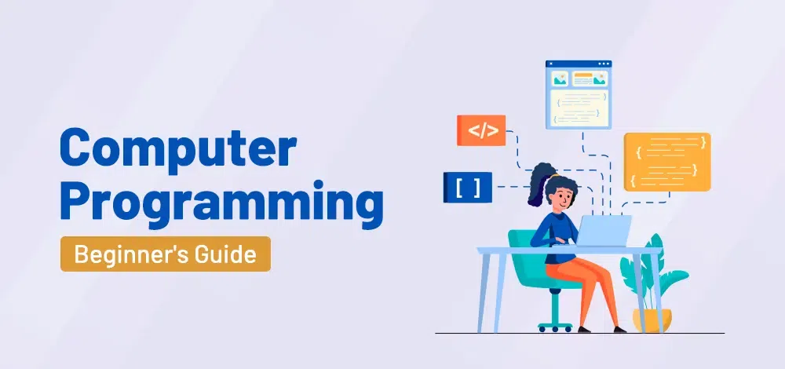

#  What is Programming?

## The World You Already Live In

Before we write a single line of code, let us take a step back and look at the world around you.

Every morning your phone alarm goes off at exactly the time you set it. When you send a message, it arrives on someone else's screen in seconds. When you pay for something with your phone, money moves from one account to another instantly. When you search for something online, millions of results appear in less than a second, ranked in a way that somehow feels relevant to you.

None of this happens by magic. None of it happens by accident. Every single one of these things happens because a programmer sat down, thought carefully about a problem, and wrote instructions for a computer to follow.

That is programming. And you are about to learn how to do it.

---

## What Exactly is a Computer?

To understand programming, you first need to understand what a computer actually is — not what it looks like on the outside, but what it does on the inside.

A computer is a machine that can store information, retrieve it, perform calculations on it, and make simple decisions based on it — and it can do all of these things billions of times per second.

That last part is what makes computers remarkable. A human can add two numbers together. A computer can add two numbers together three billion times in one second. A human can look through a list of 100 names to find one. A computer can search through a hundred million names in the time it takes you to blink.

But here is the crucial thing that most people do not realize: **a computer has absolutely no intelligence of its own.** It cannot think. It cannot decide what to do. It cannot solve a problem it has not been told how to solve. It is extraordinarily fast, but it is completely dependent on the instructions it is given.

Those instructions are called a **program**. The person who writes those instructions is called a **programmer**. The act of writing those instructions is called **programming**.

---

## The Simplest Definition

If you had to reduce programming to its simplest possible definition, it would be this:

> **Programming is the act of giving a computer a precise set of instructions to solve a problem.**

That is it. Everything else — the languages, the frameworks, the tools, the techniques — is just detail built on top of that simple idea.

The key word in that definition is **precise**. This is what separates giving instructions to a computer from giving instructions to a human.

---

## Computers vs. Humans: The Precision Problem

Imagine you ask a friend to make you a cup of tea. You say "make me a cup of tea" and walk away. Your friend knows what kind of tea you like, knows how much sugar you take, knows where the kettle is, knows not to fill the cup completely to the top so it does not spill. They use judgment, memory, context, and common sense to fill in all the gaps you left in your instruction.

Now imagine you are trying to get a robot to make you a cup of tea. You cannot just say "make me a cup of tea." The robot has no judgment, no memory of your preferences, no common sense. You have to specify everything:

1. Walk to the kitchen
2. Locate the kettle
3. Pick up the kettle
4. Walk to the sink
5. Turn on the cold tap
6. Hold the kettle under the tap until the water level reaches the 500ml mark
7. Turn off the tap
8. Walk to the counter
9. Place the kettle on the base
10. Press the power button
11. Wait until the kettle switches itself off
12. Open the cabinet above the counter
13. Take out one mug
14. Close the cabinet
15. Place the mug on the counter
16. Open the drawer to the left
17. Take out one teabag
18. Close the drawer
19. Place the teabag in the mug
...

And this is just to make a cup of tea. Imagine the instructions needed for an app used by millions of people.

This is exactly what programming is. You are writing instructions for a machine that has no judgment, no common sense, and no ability to fill in gaps. Every step must be explicit. Every possibility must be accounted for. Every edge case must be handled.

This is not a limitation — it is actually what makes computers so reliable. They do exactly what you tell them, every single time, without getting tired, distracted, or emotional. The burden is on you, the programmer, to think through every scenario carefully. Once you do, the computer will execute those instructions flawlessly, millions of times if needed.

---

## What is a Program?

A program is a complete set of instructions, written in a programming language, that tells a computer how to perform a specific task or set of tasks.

Programs come in all shapes and sizes:

A program can be tiny — a few lines of code that convert temperatures from Celsius to Fahrenheit. Or it can be enormous — the software running a major bank's transaction systems involves hundreds of millions of lines of code, written by thousands of programmers over decades.

But whether tiny or enormous, every program shares the same fundamental nature: it is a precise, ordered set of instructions that a computer follows to produce a result.

Some examples of programs you interact with every day:

- The operating system on your phone or computer — a massive program that manages all the hardware and lets other programs run
- The browser you use to access the internet — a program that reads code from websites and turns it into what you see on screen
- The messaging app you use to communicate — a program that sends your text across the internet and displays it on someone else's screen
- The navigation app that gives you directions — a program that calculates the fastest route based on maps and real-time traffic data
- The streaming service you watch videos on — a program that stores millions of videos and delivers them to your screen on demand

---

## What is a Programming Language?

Computers, at the most fundamental level, only understand one thing: electricity. Specifically, they work with electrical signals that are either on or off. This binary state — on or off, one or zero — is the foundation of everything a computer does.

All data in a computer, all instructions, all programs — at the deepest level, everything is represented as combinations of ones and zeros. This is called **binary code** or **machine code**.

Here is what "Hello" looks like in binary:

```
01001000 01100101 01101100 01101100 01101111
```

And that is just one simple word. Imagine trying to write an entire application — something like Instagram or a banking system — in binary. It would be practically impossible for a human being. Even if you could do it, it would take forever, be impossible to read, and nearly impossible to fix when something went wrong.

So engineers created **programming languages** — a middle ground between human language and machine language. Programming languages use words, symbols, and structures that humans can read and write relatively easily, and they come with tools that automatically translate those human-readable instructions into the ones and zeros the machine actually understands.

This translation process is called **compilation** or **interpretation**, depending on the language, but as a beginner you do not need to worry about the technical details. What matters is understanding the concept: you write in a language designed for humans, and a tool converts it into a language designed for machines.

### How Many Programming Languages Are There?

There are hundreds of programming languages in existence. Some are widely used by millions of developers. Some are used only in very specific industries. Some were created for research and never became popular. Some are old and still widely used. Some are brand new and gaining popularity quickly.

A small selection of well-known languages and what they are typically used for:

**Python** — Known for being extremely readable and beginner-friendly. Widely used in data science, artificial intelligence, machine learning, and automation. Also used for building web backends.

**JavaScript** — The language of the web. Originally designed to run in browsers and make web pages interactive. Now, thanks to Node.js, also used heavily for backend development — which is the focus of this course.

**Java** — A long-established, powerful language used in enterprise software, Android app development, and large-scale backend systems.

**C and C++** — Low-level languages that give programmers very direct control over the hardware. Used in operating systems, game engines, embedded systems, and anywhere performance is absolutely critical.

**Swift** — Apple's language for building iOS and macOS applications.

**Kotlin** — A modern language primarily used for Android development.

**Go** — A relatively modern language created by Google, known for simplicity and performance. Popular for building backend systems and cloud infrastructure.

**Rust** — A modern language focused on safety and performance. Growing rapidly in popularity for systems programming.

**SQL** — Not a general-purpose programming language, but a language specifically for working with databases. Every backend developer needs to know it.

### Do the Differences Between Languages Matter for a Beginner?

Not yet. And this is a very important point.

All of these languages — despite looking different on the surface — share the same fundamental concepts. They all have variables. They all have conditions. They all have loops. They all have functions. They all have ways to handle errors. They all follow the same basic logic of giving instructions to a machine.

The syntax — the specific words and symbols you use — changes from language to language. But the underlying thinking does not. Once you deeply understand how to store data, make decisions, repeat actions, and organize code, you can transfer that understanding to any language. The new language just requires learning new syntax, not new concepts.

This is why focusing on fundamentals first is so valuable. You are not just learning to write code in one specific language. You are learning how to think like a programmer — and that skill goes with you everywhere.

---

## The History of Programming — A Very Brief Overview

Understanding where programming came from gives you appreciation for how far it has come and why things are the way they are.

### The Very Beginning — 1800s

The idea of giving machines a set of instructions to follow actually predates computers by over a century. In the 1800s, a mathematician named **Charles Babbage** designed a mechanical device called the **Analytical Engine** — a machine that could, in theory, be programmed to perform any calculation.

His colleague **Ada Lovelace** wrote detailed notes on how the Analytical Engine could be programmed to calculate certain mathematical sequences. Many historians consider her the world's first programmer — more than a hundred years before modern computers existed.

### The First Electronic Computers — 1940s

The first electronic computers appeared in the 1940s. They were enormous — filling entire rooms — and they had to be programmed by physically rewiring components or entering ones and zeros directly. There were no programming languages. Programmers worked directly with machine code.

### Assembly Language and Early High-Level Languages — 1950s

In the 1950s, the first **assembly languages** appeared. These were one small step above binary — instead of writing 01001000, you could write something slightly more readable like `MOV AX, 1`. Still extremely primitive by today's standards, but a huge improvement.

Then came the first high-level programming languages. **FORTRAN** (1957) was designed for scientific calculations. **COBOL** (1959) was designed for business data processing. These were revolutionary because for the first time, programmers could write instructions that looked somewhat like mathematics or English and have them automatically translated into machine code.

### The Growth of Programming Languages — 1960s to 1990s

Over the following decades, dozens of influential languages were created. **C** (1972) became one of the most influential languages ever written — it is still widely used today and many modern languages were directly inspired by it. **C++** added object-oriented programming to C. **Java** (1995) introduced the idea of "write once, run anywhere" — code that could run on any machine regardless of the underlying hardware.

**JavaScript** was also created in 1995, originally in just ten days, to add interactivity to web pages. No one at the time imagined it would become one of the most widely used programming languages in the world.

### The Modern Era — 2000s to Today

Today, programming languages are more powerful, more readable, and more accessible than ever before. Tools that automate repetitive tasks, catch errors before you even run your code, and help you write code faster have transformed the development experience.

The internet has also transformed how programmers learn and work. Answers to almost any programming question are available online instantly. Open-source libraries mean you rarely have to build everything from scratch. Collaboration tools let programmers on opposite sides of the world work together in real time.

We are living in what is arguably the most exciting era in the history of programming.

---

## What Does a Programmer Actually Do?

There is a common misconception that programming is mostly about typing code all day. In reality, typing code is only a small part of what a programmer does.

Here is what a programmer's work actually looks like:

### Understanding the Problem

Before writing a single line of code, a programmer needs to deeply understand the problem they are trying to solve. What exactly does this system need to do? Who will use it? What are the edge cases — the unusual situations that might occur? What happens when something goes wrong?

This phase often involves talking to other people — clients, users, designers, other developers — to build a complete picture of what needs to be built.

### Designing the Solution

Once the problem is understood, the programmer thinks through how to solve it. What data needs to be stored? How should it be organized? What are the steps the program needs to take? How should different parts of the system communicate with each other?

Good design upfront saves enormous amounts of time later. Poorly designed programs become increasingly difficult to work with as they grow.

### Writing the Code

This is the part most people associate with programming. The programmer translates their design into actual code — instructions written in a programming language.

Good code is not just code that works. It is code that is readable, organized, and maintainable. Code that another programmer (or your future self) can read six months later and understand what it does and why.

### Testing

After writing code, the programmer tests it. Does it work correctly? Does it handle unusual inputs gracefully? Does it work correctly under pressure — when many users are using it at the same time, for example?

Testing is not optional. Every professional programmer writes tests for their code and takes testing seriously. Software that has not been properly tested will fail in production, often in embarrassing and costly ways.

### Debugging

When tests reveal problems — or when users report bugs — the programmer must find the source of the problem and fix it. This is called debugging.

Debugging is a skill in itself. It requires patience, systematic thinking, and the ability to reason carefully about what the program is actually doing versus what you expected it to do.

### Reviewing and Maintaining

Code does not exist in isolation. Other programmers read your code, give feedback, and suggest improvements. You read their code and do the same. This process — called **code review** — is how teams maintain quality and share knowledge.

After a program is released, it needs to be maintained. Requirements change. New features are added. Bugs are discovered and fixed. The underlying technologies it depends on are updated. A programmer's relationship with a piece of software rarely ends when it is first released.

---

## The Mindset of a Programmer

Technical skills matter, but the way you think matters more. Becoming a programmer is as much a mental transformation as a technical one.

### Problem Decomposition

The most important mental skill in programming is the ability to take a large, complex problem and break it down into smaller, simpler problems that can be solved one at a time.

A large problem feels overwhelming. The same problem, broken into ten smaller problems, becomes manageable. And each of those ten problems, broken into ten smaller steps, becomes straightforward.

This skill — decomposition — is something you will use constantly, and it gets better with practice.

### Logical Thinking

Programming requires precise, step-by-step logical thinking. You need to be able to trace through a sequence of instructions in your mind and predict exactly what will happen at each step.

This is not about being a math genius. It is about being careful and systematic. It is about checking your assumptions. It is about asking "what happens if this is not what I expect it to be?"

### Comfort with Ambiguity

Real-world programming problems are rarely perfectly defined. Requirements change. Information is incomplete. The right approach is often unclear. Good programmers are comfortable working with ambiguity — making reasonable decisions with incomplete information, and adjusting course when they learn more.

### Persistence and Patience

Programming involves a lot of failure. Code does not work on the first attempt. Bugs are frustrating and sometimes mysterious. Features take longer than expected. Plans change.

The programmers who succeed are not the ones who never fail. They are the ones who treat failure as information — "this approach does not work, so let me think about why not and try differently." They are the ones who do not give up when they hit a wall, but instead find a way over, around, or through it.

### Continuous Learning

Technology moves fast. New languages, new frameworks, new tools, new concepts appear constantly. The best programmers are perpetual learners — always curious, always reading, always experimenting, always growing.

The good news is that the fundamentals you are learning right now change very slowly. The specific technologies on top of those fundamentals change rapidly, but once you have a strong foundation, keeping up with new technologies becomes much easier.

---

## Why Programming is One of the Most Valuable Skills in the World Today

We are living through a period of history where software is transforming every industry on the planet. Healthcare, finance, agriculture, education, transportation, communication, entertainment — all of it is being reshaped by software.

This transformation is creating enormous demand for people who can build software. And that demand is not slowing down — it is accelerating.

But beyond career opportunity, programming gives you something even more valuable: **agency**. The ability to look at a problem, imagine a solution, and build it yourself. The ability to create tools that help people. The ability to automate tedious work and free up time for what matters. The ability to participate in shaping the digital world rather than just consuming it.

When you learn to program, you stop being just a user of technology and start being a creator of it.

---

## What Comes Next

Now that you understand what programming is, where it came from, what programmers actually do, and the mindset it requires, you are ready to start learning the actual building blocks.

In the chapters ahead, you will learn:

- How to store and work with data using variables and data types
- How to perform operations and make comparisons using operators
- How to make decisions and repeat actions using control flow
- How to organize your code into reusable pieces using functions
- How to work with collections of data using arrays and objects
- How to write modern, professional code using current best practices
- How to handle tasks that take time using asynchronous programming

Each concept builds on the ones before it. Take your time. Read carefully. Practice every concept before moving on. 
