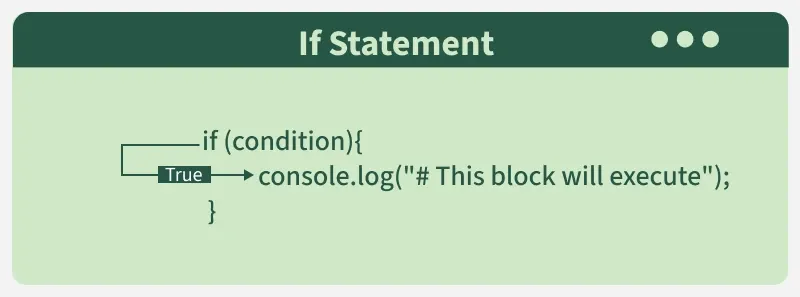
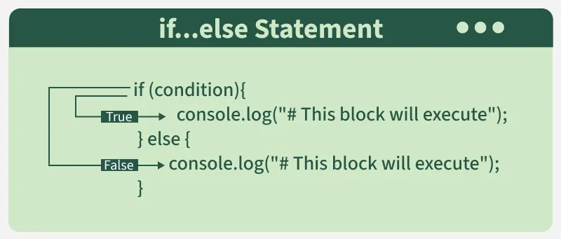
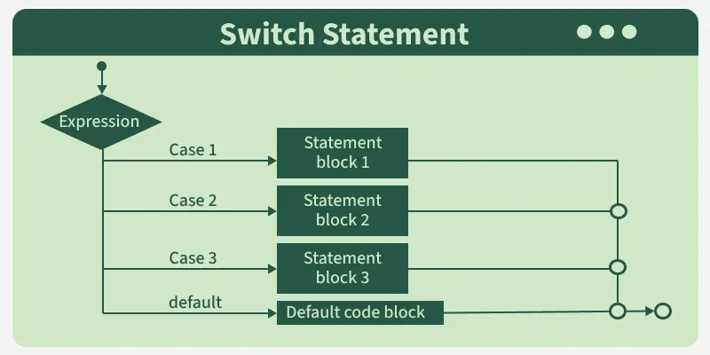

# 🟨 Module 01 — JavaScript Fundamentals

> 👋 **Hey there, future backend developer!**
> Before we build servers, APIs, or databases — we need to master the language that powers it all: **JavaScript**.
> This module is your complete foundation. Take it section by section, try every code example, and don't skip the exercises. You'll be glad you didn't. 💪

---

## 📖 Table of Contents

1. [What is JavaScript?](#1--what-is-javascript)
2. [How JavaScript Works in HTML](#2--how-javascript-works-in-html)
3. [Variables & Data Types](#3--variables--data-types)
4. [Operators](#4--operators)
5. [Control Flow](#5--control-flow)
6. [Functions](#6--functions)
7. [Arrays & Objects](#7--arrays--objects)
8. [ES6+ Features](#8--es6-features)
9. [Asynchronous JavaScript](#9--asynchronous-javascript)
10. [Promises](#10--promises)
11. [Async / Await](#11--async--await)
12. [Learning Resources](#12--learning-resources)
13. [Quick Knowledge Check](#13--quick-knowledge-check)

---

## 1 — What is JavaScript?

Think of building a house 🏠:
- **HTML** is the structure — walls, floors, and rooms.
- **CSS** is the interior design — colors, fonts, and layout.
- **JavaScript** is the electricity ⚡ — it makes everything *work*. Lights turn on, doors open, the doorbell rings.

JavaScript is a **dynamic programming language** that brings web pages to life. Any time you see a click-to-show dropdown menu, content added to a page without refreshing, or colors changing on hover — you're seeing JavaScript in action.

### 🤔 But wait — isn't JavaScript just for websites?

Not anymore! JavaScript now runs:
- In the **browser** (frontend)
- On the **server** (Node.js — that's what this whole course is about!)
- In **mobile apps** (React Native)
- In **desktop apps** (Electron)
- Even on **IoT devices**

> 💡 **Fun Fact:** JavaScript was created in just **10 days** in 1995 by Brendan Eich at Netscape. Today it's the most used programming language in the world for 11 years running (Stack Overflow Survey).

---

### What Can JavaScript Do?

| Capability | Real Example |
|---|---|
| 🖊️ Write dynamic content | Generate a user's profile page from data |
| 🎯 React to events | Run a function when a button is clicked |
| 📖 Read & modify HTML | Change a heading's text after login |
| ✅ Validate data | Check that a form email is valid before sending |
| 🍪 Store information | Save a user's theme preference locally |
| 🌐 Communicate with servers | Fetch posts from a database API |
| 🖥️ Run on the server | Handle HTTP requests with Node.js |

---

### How JavaScript Makes Things Dynamic

HTML and CSS are often called **markup languages** rather than programming languages. They define structure and style, but they have very little dynamism on their own.

JavaScript, on the other hand:
- Supports **math calculations**
- Dynamically **adds/removes HTML** from the DOM
- **Creates and changes styles** on the fly
- **Fetches content** from other servers
- Handles **user interaction** in real time

---

## 2 — How JavaScript Works in HTML

There are **three ways** to add JavaScript to a webpage. Think of them like three ways to play music in a room:

### 🎵 Method 1: Inline JavaScript

The JS code lives directly inside an HTML tag attribute:

```html
<button onclick="alert('You just clicked a button')">Click me!</button>
```

Quick for tiny things, but gets messy fast. **Avoid for real projects.**

---

### 🔊 Method 2: Internal JavaScript (using `<script>` tag)

The JS lives inside the HTML file in its own `<script>` block:

```html
<script>
  function greet() {
    alert("I am inside a script tag");
  }
</script>
```

Better for small projects, but still mixes HTML and JS in one file.

---

### 🎙️ Method 3: External JavaScript (separate `.js` file)

```html
<!-- index.html -->
<script src="./script.js"></script>
```

```js
// script.js
alert("I am inside an external file");
```

The `src` attribute tells the browser to also load `script.js`. The `.js` extension is the JavaScript file extension, just like `.html` for HTML.

> ✅ **Best Practice:** Always use **external JavaScript** for real projects. It keeps your HTML clean, your JS reusable, and your codebase organized.

---

## 3 — Variables & Data Types

### 🧠 What is a Variable?

> **Analogy #1 — The Name:** When a child is born, they are given a name. Throughout their life, when you say that name, you're referring to that specific person. Variables work the same way — a name that refers to a value.

> **Analogy #2 — Math:** When we say `x = 1`, it means "anywhere you see x, replace it with 1". The variable `x` *points to* the value `1`.

> **Analogy #3 — A Container:** A variable is like a labeled box. The variable **name** is the label, the **value** is what's inside, and the **type** is the kind of thing inside.

```js
/* The code below means x is 1
 * So during execution, anywhere x appears after this line,
 * the compiler replaces x with 1.
 */
let x = 1;
let y = 1; // y also refers to 1, but it's a DIFFERENT 1 from x's
console.log(x); // 1
```

---

### How to Declare, Assign & Initialize

```js
let score;       // Declaration — creates an empty container
score = 10;      // Assignment — puts a value in it
let age = 20;    // Initialization — declaration + assignment at once
```

- **Declaring** = buying a box 📦
- **Assigning** = putting something in the box
- **Initializing** = buying a box that already has something in it

---

### The Three Keywords: `let`, `const`, `var`

| Keyword | Reassignable? | Scope | Use When |
|---|---|---|---|
| `let` | ✅ Yes | Block `{}` | Value will change over time |
| `const` | ❌ No | Block `{}` | Value never changes |
| `var` | ✅ Yes | Function | Legacy code only — avoid! |

```js
let username = "Alex";    // Can be reassigned
const PI = 3.14159;       // Can NEVER be changed
username = "Jordan";      // ✅ Works
PI = 3;                   // ❌ TypeError: Assignment to constant variable
```

> 💡 **Rule of Thumb:** Start with `const`. If you later realize the value needs to change, switch to `let`. Never use `var` in modern code.

---

### How to Call a Variable

To use a variable, simply mention its name. During execution, the name is replaced with its value:

```js
let score = 10;
console.log(score + 1); // 11 → score is replaced by 10, so: 10 + 1 = 11
```

---

### How to Name Variables

**Rules (required):**
- Cannot start with a number: ❌ `1score` → ✅ `score1`
- No spaces allowed: ❌ `my score` → ✅ `myScore`
- Cannot use reserved words like `let`, `if`, `return`, `class`, `function`
- Case-sensitive: `score` and `Score` are **different** variables

**Reserved Words** (you don't need to memorize these — just know they exist):
> `arguments` `await` `break` `case` `catch` `class` `const` `continue` `debugger` `default` `delete` `do` `else` `enum` `eval` `export` `extends` `false` `finally` `for` `function` `if` `implements` `import` `in` `Infinity` `instanceof` `interface` `let` `NaN` `new` `null` `package` `private` `protected` `public` `return` `static` `super` `switch` `this` `throw` `true` `try` `typeof` `undefined` `var` `void` `while` `with` `yield`

**Naming Conventions (best practices):**

```js
let firstName = "Ada";          // camelCase — for regular variables
const MAX_RETRIES = 3;          // UPPER_SNAKE_CASE — for constants
let _privateValue = 42;         // underscore prefix — marks as private
let isLoggedIn = true;          // is/has prefix — for Booleans
let publishedDate = "Aug 2023"; // descriptive, self-explanatory names
```

> 🧠 **Tip:** A variable name should tell a story. `x` tells you nothing. `userAge` tells you exactly what it holds and why.

---

## Data Types

The **type** of a variable determines what operations you can perform on it. You can add two numbers, but you can't add two photos. You can drink water but not eat it.

JavaScript data types split into two groups:

```
┌─────────────────────────────────────────────────────────┐
│                    JAVASCRIPT TYPES                      │
├──────────────────────────┬──────────────────────────────┤
│     PRIMITIVE TYPES      │      REFERENCE TYPES         │
│  (stored by VALUE)       │  (stored by REFERENCE)       │
├──────────────────────────┼──────────────────────────────┤
│  Number                  │  Object                      │
│  String                  │  Array                       │
│  Boolean                 │  Function                    │
│  Undefined               │                              │
│  Null                    │                              │
│  BigInt                  │                              │
│  Symbol                  │                              │
└──────────────────────────┴──────────────────────────────┘
```

---

### 🔢 Number

In JavaScript, **all numbers** are floating-point values — whether whole or decimal, positive or negative.

```js
let score1 = 2;
let score2 = 5;
let averageScore = (score1 + score2) / 2;
console.log(averageScore); // 3.5
console.log(typeof score1); // "number"
```

**Exercise:** Copy this code into your editor and try changing the values. Use `typeof` to inspect them.

**Special Number Values:**

```js
let result = 12 / 0;
console.log(result);                       // Infinity
console.log(Number.NEGATIVE_INFINITY);     // -Infinity
const invalid = "Ella" / 2;
console.log(invalid);                      // NaN — Not a Number
```

> ⚠️ **NaN** means you tried a math operation on something that isn't a number. When you see it, trace back to what value was involved in the operation.
> Infinity/-Infinity are rare as a beginner, but knowing they exist saves confusion.

---

### 🔤 String

A string is a **sequence of characters** wrapped in quotes. You can use single quotes `'`, double quotes `"`, or backticks `` ` ``.

```js
let author = "Sleekcodes";
let publishedDate = "14 August 2023";

console.log("Written by: " + author);        // Written by: Sleekcodes
console.log("Published on: " + publishedDate); // Published on: 14 August 2023
```

The `+` between strings **joins them together** — this is called **string concatenation**.

**Modern way — Template Literals (ES6):**

```js
let city = "Addis Ababa";
let message = `Welcome to ${city}!`; // backtick + ${variable}
console.log(message); // Welcome to Addis Ababa!
```

> ✅ Prefer template literals over `+` concatenation. They're cleaner, more readable, and support multi-line strings.

A string with zero characters is called an **empty string**: `""`

---

### ✅ Boolean

Booleans represent only **two states**: `true` or `false`. On/Off. Yes/No.

```js
let isQualified = true;

if (isQualified) {
  console.log("Tola is qualified"); // This runs because isQualified is true
}
```

**Exercise:** Change `isQualified` to `false` and observe what happens.

> 💡 Booleans power every decision in your code. Every `if`, every condition, every comparison — all of it resolves to `true` or `false`.

---

### ❓ Undefined

`undefined` is both a **value and a type**. It means a variable exists but has no assigned value yet.

```js
let age; // declared but no value given
console.log(age); // undefined — JavaScript assigned this automatically
```

**Exercise:** Use `typeof age` to see what type `undefined` is. Then assign `undefined` explicitly and check again.

---

### 🚫 Null

`null` is a value **you assign intentionally** to say "this container is empty right now."

```js
let age = null; // explicitly set to empty
console.log(age); // null
```

**The Key Difference:**

| | `undefined` | `null` |
|---|---|---|
| Who sets it? | JavaScript (automatic) | You, the developer |
| Meaning | "No value was assigned yet" | "I intentionally set this to empty" |
| Rule | Don't assign it yourself | Use when a value is purposely absent |

> 🧠 As a rule: never manually assign `undefined`. Use `null` when you want to say "empty on purpose."

---

### 📦 Reference Types — Passed by Reference

Here's where things get interesting. With **primitive types**, the value is stored directly in the variable:

```
Primitive:   variable ──────────────→ value
```

With **reference types**, the variable stores a *reference* (like a GPS coordinate) that points to the actual data:

```
Reference:   variable → reference address → actual value
```


*(Part A is your code. Part B is what happens in memory behind the scenes.)*

**Why does this matter?** Watch carefully:

```js
let studentInfo = {
  name: "John Doe",
  age: 205
};

let staffInfo = studentInfo; // staffInfo stores the SAME reference as studentInfo

staffInfo.name = "Lorry Sante"; // changes the value the reference points to

console.log(studentInfo.name); // "Lorry Sante" — it changed too!
```


Both `studentInfo` and `staffInfo` are pointing to the **same object in memory**. Changing the name through one variable affects the other, because they're both GPS coordinates pointing to the same location.


> 🔁 If this feels confusing, re-read this section. Understanding pass-by-reference is one of the most important concepts in your entire JavaScript career.

---

### 🗂️ Object

An object stores **related data as key-value pairs** — perfect for representing real-world things.

```js
let studentInfo = {
  name: "John Doe",
  age: 205
};
```

To access a value, use **dot notation**: `objectName.key`

```js
console.log(studentInfo.name); // "John Doe"
console.log(studentInfo.age);  // 205
```

Objects can **nest** other objects:

```js
let studentInfo = {
  name: "John Doe",
  age: 205,
  beneficiary: {
    name: "Tira Doe",
    age: 200,
    relationship: "Wife"
  }
};

// Access nested values with chained dot notation
console.log(studentInfo.beneficiary.name); // "Tira Doe"
```

> 💡 There's no limit to nesting objects — but keep it reasonable. Deep nesting gets hard to read and maintain.

---

### 📋 Array

An array stores a **list of values**, accessed by their position (**index**), starting at `0`.

```js
let scores = [1, 3, 5, 6, 9, 12];

console.log(scores[0]); // 1 — first item
console.log(scores[3]); // 6 — fourth item
```


```
Index:   0    1    2    3    4    5
Value:  [1,   3,   5,   6,   9,  12]
```

To access `80` in a `scores` array at position 3: `scores[3]`

> ⚠️ Arrays are **zero-indexed**. The first item is always at index `0`. This catches almost every beginner at least once!

Arrays can technically hold mixed types, but **don't do it** — keep all values the same type:
```js
// ❌ Bad practice
let mixed = [1, "hello", true, {name: "John"}];

// ✅ Good practice
let prices = [10.99, 24.50, 5.00, 99.99];
```

---

### ⚙️ Function (Introduction)

A function is a **reusable block of code** that performs a specific task. Write it once, call it anytime.

**Without a function (repetitive 😓):**
```js
let num1 = 2, num2 = 3;
let result = num1 + num2;
console.log(result); // 5

let num3 = 3, num4 = 8;
let result2 = num3 + num4;
console.log(result2); // 11
```

**With a function (clean ✅):**
```js
function addNumbers(num1, num2) {
  return num1 + num2;
}

console.log(addNumbers(2, 3)); // 5
console.log(addNumbers(3, 8)); // 11
```

See how much cleaner that is? Functions are covered in detail in [Section 6](#6--functions).

---

## 4 — Operators

### ➕ Arithmetic Operators

| Operator | Name | Purpose | Example |
|---|---|---|---|
| `+` | Addition | Adds two numbers | `6 + 9` → `15` |
| `-` | Subtraction | Subtracts right from left | `20 - 15` → `5` |
| `*` | Multiplication | Multiplies two numbers | `3 * 7` → `21` |
| `/` | Division | Divides left by right | `10 / 5` → `2` |
| `%` | Remainder (Modulo) | Returns the leftover after division | `8 % 3` → `2` |
| `**` | Exponent | Raises to a power | `5 ** 2` → `25` |

> 📝 **Note:** `Math.pow(7, 3)` is the older equivalent of `7 ** 3`. Both return `343`.

**Try these in your console:**
```js
10 + 7;
9 * 8;
60 % 3;

const num1 = 10;
const num2 = 50;
9 * num1;
num1 ** 3;
num2 / num1;

5 + 10 * 3;       // What do you expect?
(num2 % 9) * num1;
num2 + num1 / 8 + 2;
```

---

### 📐 Operator Precedence

JavaScript follows the same math rules you learned in school — multiplication and division happen **before** addition and subtraction.

```js
// num2 = 50, num1 = 10
num2 + num1 / 8 + 2;
// Browser reads: 10 / 8 = 1.25 → 50 + 1.25 + 2 = 53.25
// NOT: 50 + 10 = 60 → 60 / 8 = 7.5 (that's how a human might read it left-to-right)
```

Use **parentheses** to force the order you want:

```js
(num2 + num1) / (8 + 2); // (60) / (10) = 6
```

---

### 🔼 Increment & Decrement

```js
let num1 = 4;
num1++;        // Post-increment: returns 4, THEN increments to 5
num1;          // Now shows 5

let num2 = 6;
num2--;        // Post-decrement: returns 6, THEN decrements to 5
num2;          // Now shows 5
```

> 📝 **Note:** `++num1` (prefix) increments first then returns. `num1++` (postfix) returns first then increments. Try both in your console to see the difference.

---

### 📝 Assignment Operators

| Operator | Name | Purpose | Example | Shortcut For |
|---|---|---|---|---|
| `=` | Assignment | Assigns value | `x = 5` | — |
| `+=` | Addition assignment | Adds then assigns | `x += 4` | `x = x + 4` |
| `-=` | Subtraction assignment | Subtracts then assigns | `x -= 3` | `x = x - 3` |
| `*=` | Multiplication assignment | Multiplies then assigns | `x *= 3` | `x = x * 3` |
| `/=` | Division assignment | Divides then assigns | `x /= 5` | `x = x / 5` |

```js
let x = 3; // x contains 3
let y = 4; // y contains 4
x = y;     // x now contains 4

x *= y;    // x now contains 16 (4 * 4)
```

---

### ⚖️ Comparison Operators

Comparison operators always return `true` or `false`.

| Operator | Name | Purpose | Example |
|---|---|---|---|
| `===` | Strict equality | Value AND type must match | `5 === 2 + 3` |
| `!==` | Strict non-equality | Value OR type must differ | `5 !== 2 + 3` |
| `<` | Less than | Left is smaller than right | `10 < 6` |
| `>` | Greater than | Left is greater than right | `10 > 20` |
| `<=` | Less than or equal | Left is ≤ right | `3 <= 2` |
| `>=` | Greater than or equal | Left is ≥ right | `5 >= 4` |

> ⚠️ **`==` vs `===`**: `==` checks value only (dangerous). `===` checks value AND type (safe). Always use `===`.
> ```js
> 5 == "5"   // true  ← JS quietly converts "5" to 5 (type coercion)
> 5 === "5"  // false ← strict: number ≠ string
> ```

**Real example — a toggle button:**

```html
<button>Start machine</button>
<p>The machine is stopped.</p>
```

```js
const btn = document.querySelector("button");
const txt = document.querySelector("p");

btn.addEventListener("click", updateBtn);

function updateBtn() {
  if (btn.textContent === "Start machine") {
    btn.textContent = "Stop machine";
    txt.textContent = "The machine has started!";
  } else {
    btn.textContent = "Start machine";
    txt.textContent = "The machine is stopped.";
  }
}
```

> 📝 This is called a **toggle** — a control that switches between two states (on/off, start/stop, show/hide).

---

## 5 — Control Flow

Control flow is how you make your program **decide** and **repeat**. Without it, code just runs straight from top to bottom — no decisions, no loops, no logic.

---

### 🚦 if Statement

Executes a block of code **only if** a condition is true.



```js
const age = 18;
if (age >= 18) {
  console.log("You are an adult.");
}
// Checks if age >= 18. Logs "You are an adult." only if true.
```

---

### 🔀 if...else Statement

Provides an **alternative** block if the condition is false.



```js
const score = 40;
if (score >= 50) {
  console.log("You passed.");
} else {
  console.log("You failed.");
}
// Logs "You failed." because 40 < 50
```

---

### 🪜 if...else if...else Statement

Handles **multiple conditions** in sequence.


```js
const temp = 25;
if (temp > 30) {
  console.log("It's hot.");
} else if (temp >= 20) {
  console.log("It's warm."); // This runs — 25 is between 20 and 30
} else {
  console.log("It's cold.");
}
```

Think of it like a bouncer — the first condition that passes is the one that runs. The rest are skipped.

---

### 🎛️ switch Statement

Evaluates an expression and runs the matching `case`. Cleaner than long `if/else` chains when checking one variable against multiple exact values.



```js
const day = "Monday";
switch (day) {
  case "Monday":
    console.log("Start of the week.");
    break;
  case "Friday":
    console.log("End of the workweek.");
    break;
  default:
    console.log("It's a regular day.");
}
```

- Checks `day` and runs the matching case
- `break` exits the switch — **without it**, execution continues into the next case (fall-through)
- `default` runs when no cases match

> ⚠️ **Fall-through behavior:** Without `break`, JavaScript keeps executing into the next case even if it doesn't match. This is sometimes intentional, but usually a bug.

---

### ❓ Ternary Operator

A compact one-liner if/else — great for simple decisions:


```js
let a = 10;
console.log(a === 5 ? "a is equal to 5" : "a is not equal to 5");
// "a is not equal to 5"
```

Syntax: `condition ? valueIfTrue : valueIfFalse`

- `a === 5` — checks if a is strictly equal to 5
- Returns `"a is equal to 5"` if true
- Returns `"a is not equal to 5"` if false

---

### 🔄 Looping Statements

Loops run a block of code **repeatedly** based on a condition.

#### `for` Loop — when you know the number of iterations

```js
for (let i = 1; i <= 3; i++) {
  console.log(i);
}
// 1, 2, 3
```

Three parts: `let i = 1` (initialize), `i <= 3` (condition), `i++` (update after each iteration). Runs until the condition becomes false.

---

#### `while` Loop — runs as long as condition is true

```js
let i = 1;
while (i <= 3) {
  console.log(i);
  i++;
}
// 1, 2, 3
```

Checks the condition **before** each iteration. If the condition is false from the start, it never runs.

---

#### `do...while` Loop — runs at least once

```js
let i = 1;
do {
  console.log(i);
  i++;
} while (i <= 3);
// 1, 2, 3
```

Executes the block **first**, then checks the condition. Guarantees at least one execution.

---

### Control: `break` and `continue`

```js
// break — exit the loop entirely
for (let i = 0; i < 10; i++) {
  if (i === 5) break;
  console.log(i); // 0, 1, 2, 3, 4
}

// continue — skip this iteration, move to next
for (let i = 0; i < 5; i++) {
  if (i === 2) continue;
  console.log(i); // 0, 1, 3, 4
}
```

**Uses of Control Flow:**
- **Decision-Making:** Execute code based on conditions (`if`, `if...else`)
- **Branching:** Exit or skip iterations (`break`, `continue`)
- **Looping:** Repeat tasks (`for`, `while`, `do...while`)
- **Switching:** Handle multiple exact-match conditions (`switch`)

---

## 6 — Functions

### 🎯 What is a Function?

A function is a **reusable block of code** that performs a specific task. Instead of writing the same logic multiple times, you write it once, name it, and call it whenever you need it.

> **Analogy:** A function is like a kitchen appliance. You buy a blender once. Every morning you press the button — it does its job. You don't buy a new blender every morning.

**Syntax:**

```js
function functionName(parameter1, parameter2) {
  // task to carry out
  return result;
}

// Call/invoke the function
functionName(argument1, argument2);
```

**Real example:**

```js
//         name          params
function multiplyNumbers(num1, num2) {
  return num1 * num2; // task
}

multiplyNumbers(2, 3); // 6 — 2 and 3 are arguments
multiplyNumbers(4, 5); // 20
```

---

### Parameters vs Arguments

```
function add(num1, num2)  ← num1, num2 are PARAMETERS (placeholders)
           add(5, 10)     ← 5, 10 are ARGUMENTS (actual values)
```

- **Parameter** = the variable defined in the function signature
- **Argument** = the actual value passed when calling the function

---

### The `return` Keyword

Functions can return a value — or not.

```js
function sayHi() {
  console.log("Hi"); // logs to console but returns undefined
}

function greet(name) {
  return `Hello, ${name}!`; // returns a value to the caller
}

let message = greet("Marta");
console.log(message); // "Hello, Marta!"
```

> Think of it like sending a helper on an errand:
> - **No return** = helper does the job but gives you no report
> - **With return** = helper comes back and hands you the result

---

### Function Naming Conventions

```js
// ✅ Use verbs — functions DO things
function getUserData() {}
function calculateTotal() {}
function sendEmail() {}

// ❌ Avoid nouns
function userData() {}
function total() {}
```

---

### Function Expressions

Functions can also be stored in variables:

```js
const add = function(a, b) {
  return a + b;
};

console.log(add(3, 4)); // 7
```

---

### Arrow Functions (ES6)

A shorter, modern syntax for functions (covered more in [Section 8](#8--es6-features)):

```js
// Traditional
function add(a, b) { return a + b; }

// Arrow function
const add = (a, b) => a + b;

console.log(add(3, 4)); // 7
```

---

### Scope

**Scope** determines where a variable is accessible.

```js
let globalVar = "I'm global"; // accessible everywhere

function myFunction() {
  let localVar = "I'm local"; // only accessible inside this function
  console.log(globalVar);     // ✅ Can access global
  console.log(localVar);      // ✅ Can access local
}

console.log(globalVar); // ✅
console.log(localVar);  // ❌ ReferenceError: localVar is not defined
```

> 🧠 Think of scope like rooms in a building. Everyone in the building can access the lobby (global). But only people in Room 5 can access what's in Room 5 (local).

---

## 7 — Arrays & Objects

### 📋 Arrays — Deep Dive

An array is an **ordered list** of values.

```js
let fruits = ["apple", "banana", "mango"];
console.log(fruits[0]); // "apple"
console.log(fruits.length); // 3
```

#### Common Array Methods

```js
let scores = [85, 90, 78, 92, 88];

// Add/remove items
scores.push(95);          // Add to end → [85, 90, 78, 92, 88, 95]
scores.pop();             // Remove from end → [85, 90, 78, 92, 88]
scores.unshift(70);       // Add to start → [70, 85, 90, 78, 92, 88]
scores.shift();           // Remove from start → [85, 90, 78, 92, 88]

// Find & check
console.log(scores.indexOf(90));     // 1 — position of 90
console.log(scores.includes(78));    // true
console.log(scores.length);          // 5

// Transform
let doubled = scores.map(s => s * 2);         // [170, 180, 156, 184, 176]
let passed  = scores.filter(s => s >= 85);    // [85, 90, 92, 88]
let total   = scores.reduce((sum, s) => sum + s, 0); // 433

// Iterate
scores.forEach(score => console.log(score));

// Sort
scores.sort((a, b) => a - b); // [78, 85, 88, 90, 92] — ascending
```

#### Destructuring Arrays

```js
let [first, second, ...rest] = [10, 20, 30, 40, 50];
console.log(first);  // 10
console.log(second); // 20
console.log(rest);   // [30, 40, 50]
```

---

### 🗂️ Objects — Deep Dive

Objects store **key-value pairs** representing real-world entities.

```js
let student = {
  name: "Marta",
  age: 21,
  isEnrolled: true,
  grades: [90, 85, 92],
  address: {
    city: "Addis Ababa",
    country: "Ethiopia"
  }
};
```

#### Accessing Properties

```js
// Dot notation (preferred)
console.log(student.name);             // "Marta"
console.log(student.address.city);     // "Addis Ababa"

// Bracket notation (use when key is dynamic or has spaces)
let key = "name";
console.log(student[key]);             // "Marta"
console.log(student["isEnrolled"]);    // true
```

#### Modifying Objects

```js
student.age = 22;                   // Update existing
student.email = "marta@email.com";  // Add new property
delete student.isEnrolled;          // Remove property
```

#### Useful Object Methods

```js
let person = { name: "Abel", age: 25, city: "Hawassa" };

Object.keys(person);    // ["name", "age", "city"]
Object.values(person);  // ["Abel", 25, "Hawassa"]
Object.entries(person); // [["name","Abel"], ["age",25], ["city","Hawassa"]]
```

#### Destructuring Objects

```js
let { name, age, city = "Unknown" } = person;
console.log(name); // "Abel"
console.log(age);  // 25
console.log(city); // "Hawassa"
```

#### Spread Operator with Objects

```js
let defaults = { theme: "dark", language: "en", fontSize: 14 };
let userSettings = { ...defaults, language: "am", fontSize: 16 };
// { theme: "dark", language: "am", fontSize: 16 }
```

---

## 8 — ES6+ Features

ES6 (released in 2015) and later versions brought major improvements. These are the features you'll use **every single day** as a developer.

---

### 🏹 Arrow Functions

Shorter function syntax. When the body is a single expression, `{}` and `return` are optional:

```js
// Traditional
function square(n) { return n * n; }

// Arrow — full
const square = (n) => { return n * n; };

// Arrow — shorthand (single expression)
const square = n => n * n;

console.log(square(5)); // 25
```

> ⚠️ Arrow functions don't have their own `this`. This matters in object methods — covered in Node.js section.

---

### 📝 Template Literals

Cleaner string formatting using backticks:

```js
let name = "Dawit";
let score = 95;

// Old way
console.log("Hello " + name + ", your score is " + score);

// Template literal
console.log(`Hello ${name}, your score is ${score}`);

// Multi-line (impossible with regular strings)
let html = `
  <div>
    <h1>${name}</h1>
    <p>Score: ${score}</p>
  </div>
`;
```

---

### 📦 Destructuring

Extract values from arrays and objects cleanly:

```js
// Array destructuring
let [a, b, c] = [1, 2, 3];
console.log(a, b, c); // 1 2 3

// Object destructuring
let { firstName, lastName, age } = { firstName: "Hana", lastName: "Tekle", age: 22 };
console.log(firstName); // "Hana"

// Rename while destructuring
let { firstName: fName } = { firstName: "Hana" };
console.log(fName); // "Hana"

// Default values
let { role = "user" } = { firstName: "Hana" };
console.log(role); // "user"
```

---

### 🌊 Spread & Rest Operators (`...`)

Same syntax (`...`), different contexts:

```js
// SPREAD — expands an array/object
let nums = [1, 2, 3];
let moreNums = [...nums, 4, 5, 6]; // [1, 2, 3, 4, 5, 6]

let obj1 = { a: 1 };
let obj2 = { ...obj1, b: 2 };      // { a: 1, b: 2 }

// REST — collects remaining items into an array
function sum(...numbers) {
  return numbers.reduce((total, n) => total + n, 0);
}
console.log(sum(1, 2, 3, 4, 5)); // 15
```

---

### 🔢 Default Parameters

Provide fallback values if an argument isn't passed:

```js
function greet(name = "stranger", greeting = "Hello") {
  return `${greeting}, ${name}!`;
}

console.log(greet("Marta", "Hey")); // "Hey, Marta!"
console.log(greet("Marta"));        // "Hello, Marta!"
console.log(greet());               // "Hello, stranger!"
```

---

### 📋 Enhanced Object Literals

```js
let name = "Yonas";
let age = 24;

// Old way
let student = { name: name, age: age };

// ES6 shorthand — when key and variable name match
let student = { name, age };
console.log(student); // { name: "Yonas", age: 24 }

// Method shorthand
let obj = {
  greet() {             // instead of greet: function() {}
    return "Hello!";
  }
};
```

---

### 📦 Modules (import / export)

Split your code across files and share between them:

```js
// math.js — named exports
export function add(a, b) { return a + b; }
export function subtract(a, b) { return a - b; }
export const PI = 3.14159;

// main.js — named imports
import { add, subtract, PI } from './math.js';
console.log(add(2, 3)); // 5

// Default export (one per file)
export default function multiply(a, b) { return a * b; }

// Default import (any name works)
import multiply from './math.js';
```

> 💡 In Node.js you'll also see `module.exports` and `require()` — the CommonJS system. ES modules (`import`/`export`) are the modern standard.

---

## 9 — Asynchronous JavaScript

### ⏳ Why Asynchronous?

JavaScript is **single-threaded** — it can only do one thing at a time. But real applications need to:
- Fetch data from a database (takes time)
- Read a file from disk (takes time)
- Call an external API (takes time)

If JavaScript **waited** (blocked) for each of these, your app would freeze. That's where asynchronous code comes in.

```
SYNCHRONOUS (blocking):
─────────────────────────────────────────────
Task 1 ████████ | Task 2 ████████ | Task 3 ██
                                              → Total: 3x time

ASYNCHRONOUS (non-blocking):
─────────────────────────────────────────────
Task 1 ████░░░░
Task 2    ████░░░░       → All start, finish when ready
Task 3       ████░░░░
```

---

### 🔄 The Event Loop

JavaScript handles async through the **Event Loop**:

```
┌─────────────────────────────────────┐
│           Call Stack                │  ← Runs your code (one at a time)
├─────────────────────────────────────┤
│           Web APIs / Node APIs      │  ← Handles async tasks (timers, fetch, fs)
├─────────────────────────────────────┤
│           Callback Queue            │  ← Async results wait here
├─────────────────────────────────────┤
│           Event Loop                │  ← Moves callbacks to stack when stack is empty
└─────────────────────────────────────┘
```

**Simple illustration:**

```js
console.log("1 - Start");

setTimeout(() => {
  console.log("3 - Inside timeout (async)");
}, 0); // Even 0ms delay is async!

console.log("2 - End");

// Output:
// 1 - Start
// 2 - End
// 3 - Inside timeout (async)  ← runs AFTER synchronous code finishes
```

> 🧠 Even with a 0ms timeout, the callback goes to the callback queue and only runs after the current synchronous code finishes. This is the event loop in action.

---

### 📞 Callbacks (Old Way)

Before Promises, async was handled with **callback functions** — functions passed as arguments to be called later:

```js
function fetchUserData(userId, callback) {
  setTimeout(() => {
    // Simulating a database call
    const user = { id: userId, name: "Marta" };
    callback(null, user); // null = no error, user = result
  }, 1000);
}

fetchUserData(1, (error, user) => {
  if (error) {
    console.log("Error:", error);
    return;
  }
  console.log("User:", user.name); // "Marta" (after 1 second)
});
```

**The problem — Callback Hell 😱:**

```js
// Each step depends on the previous — leads to deeply nested code
getUser(id, (err, user) => {
  getPosts(user.id, (err, posts) => {
    getComments(posts[0].id, (err, comments) => {
      getLikes(comments[0].id, (err, likes) => {
        // 😱 The pyramid of doom
      });
    });
  });
});
```

This is hard to read, hard to debug, and hard to maintain. Promises were created to solve this.

---

## 10 — Promises

### 🤝 What is a Promise?

A Promise is an object that represents the **eventual result** of an async operation. It's a guarantee: "I don't have the result yet, but I promise I'll give it to you when it's ready — whether it succeeds or fails."

**A Promise has three states:**

```
┌──────────┐      resolves      ┌──────────┐
│ PENDING  │ ─────────────────→ │ FULFILLED│
│          │                    │ (success)│
│ (waiting)│ ─────────────────→ ├──────────┤
└──────────┘      rejects       │ REJECTED │
                                │ (failure)│
                                └──────────┘
```

---

### Creating a Promise

```js
const myPromise = new Promise((resolve, reject) => {
  // Simulating an async operation (like a database query)
  const success = true;

  if (success) {
    resolve("Data fetched successfully! ✅"); // fulfilled
  } else {
    reject("Something went wrong ❌");        // rejected
  }
});
```

---

### Consuming a Promise with `.then()` and `.catch()`

```js
myPromise
  .then(result => {
    console.log(result); // "Data fetched successfully! ✅"
  })
  .catch(error => {
    console.log(error);  // "Something went wrong ❌"
  })
  .finally(() => {
    console.log("Promise settled — success or fail."); // always runs
  });
```

---

### Promise Chaining — solving callback hell

```js
fetchUser(1)
  .then(user => fetchPosts(user.id))      // each .then receives the result of the last
  .then(posts => fetchComments(posts[0].id))
  .then(comments => console.log(comments))
  .catch(error => console.log("Error:", error)); // one catch handles all errors
```

Much cleaner than nested callbacks!

---

### Promise.all — run multiple promises at once

```js
const promise1 = fetch('/api/users');
const promise2 = fetch('/api/posts');
const promise3 = fetch('/api/comments');

Promise.all([promise1, promise2, promise3])
  .then(([users, posts, comments]) => {
    // All three completed successfully
    console.log(users, posts, comments);
  })
  .catch(error => {
    // If ANY promise fails, this catch runs
    console.log("One failed:", error);
  });
```

> ✅ `Promise.all` runs all promises **in parallel** — much faster than running them one after another.

---

### Other Promise Methods

| Method | Behavior |
|---|---|
| `Promise.all()` | Waits for ALL to succeed. Fails if any fails |
| `Promise.allSettled()` | Waits for ALL to finish (regardless of success/fail) |
| `Promise.race()` | Resolves/rejects as soon as the **first** one settles |
| `Promise.any()` | Resolves as soon as **any one** succeeds |

---

## 11 — Async / Await

### ✨ What is Async/Await?

Async/Await is **syntactic sugar on top of Promises** — it lets you write async code that *looks* and *reads* like synchronous code. No more chains of `.then()`.

- `async` — marks a function as asynchronous (it automatically returns a Promise)
- `await` — pauses the function execution until the Promise resolves

```js
// With Promises (.then chain)
function loadUser() {
  return fetchUser(1)
    .then(user => fetchPosts(user.id))
    .then(posts => console.log(posts))
    .catch(err => console.log(err));
}

// With Async/Await (same thing, reads like normal code)
async function loadUser() {
  try {
    const user  = await fetchUser(1);       // wait for user
    const posts = await fetchPosts(user.id); // wait for posts
    console.log(posts);
  } catch (err) {
    console.log(err);
  }
}
```

---

### Error Handling with try/catch

```js
async function getUserData(userId) {
  try {
    const response = await fetch(`https://api.example.com/users/${userId}`);

    if (!response.ok) {
      throw new Error(`HTTP error! status: ${response.status}`);
    }

    const data = await response.json(); // await the json parsing too
    console.log(data);
    return data;

  } catch (error) {
    console.error("Failed to fetch user:", error.message);
  }
}

getUserData(1);
```

---

### Real Backend Example (Node.js Preview)

Here's a taste of how you'll use async/await every day in backend development:

```js
// Reading a file asynchronously in Node.js
const fs = require('fs').promises;

async function readConfig() {
  try {
    const content = await fs.readFile('./config.json', 'utf8');
    const config  = JSON.parse(content);
    console.log("Database host:", config.dbHost);
  } catch (error) {
    console.error("Could not read config:", error.message);
  }
}

readConfig();
```

---

### Parallel Execution with Async/Await

```js
async function loadDashboard() {
  try {
    // ❌ Sequential — slow (waits for each one)
    const user    = await getUser();
    const posts   = await getPosts();
    const notifs  = await getNotifications();

    // ✅ Parallel — fast (all run at the same time)
    const [user, posts, notifs] = await Promise.all([
      getUser(),
      getPosts(),
      getNotifications()
    ]);

    console.log(user, posts, notifs);
  } catch (error) {
    console.error(error);
  }
}
```

> 💡 Use `Promise.all` with `await` when your async operations don't depend on each other. It can dramatically speed up your code.

---

## 12 — Learning Resources

### 📺 YouTube — Watch & Learn

| Resource | Best For |
|---|---|
| [JavaScript Full Course – freeCodeCamp](https://www.youtube.com/watch?v=PkZNo7MFNFg) | Complete beginner foundation (3 hrs) |
| [JavaScript Crash Course – Traversy Media](https://www.youtube.com/watch?v=hdI2bqOjy3c) | Quick practical overview |
| [Async JS – The Net Ninja](https://www.youtube.com/playlist?list=PL4cUxeGkcC9jx2TTZk3IGWKSbtugYdrlu) | Callbacks, Promises, Async/Await |
| [JS Event Loop – Philip Roberts (JSConf)](https://www.youtube.com/watch?v=8aGhZQkoFbQ) | Best explanation of the event loop |
| [ES6+ Features – Traversy Media](https://www.youtube.com/watch?v=NCwa_xi0Uuc) | Modern JS features |
| [Promises – Web Dev Simplified](https://www.youtube.com/watch?v=DHvZLI7Db8E) | Promises explained clearly |

---

### 📚 Official Documentation

| Resource | Link |
|---|---|
| MDN Web Docs (JavaScript) | [developer.mozilla.org/en-US/docs/Web/JavaScript](https://developer.mozilla.org/en-US/docs/Web/JavaScript) |
| JavaScript.info | [javascript.info](https://javascript.info) — Best structured guide for beginners |
| ECMAScript Specification | [tc39.es/ecma262](https://tc39.es/ecma262) — The official language specification |
| Node.js Docs | [nodejs.org/en/docs](https://nodejs.org/en/docs) |

---

### 📖 Articles & Guides

| Article | Topic |
|---|---|
| [You Don't Know JS (free book series)](https://github.com/getify/You-Dont-Know-JS) | Deep dive into JS internals |
| [Event Loop — MDN](https://developer.mozilla.org/en-US/docs/Web/JavaScript/Event_loop) | How the event loop works |
| [Promises/A+ Spec](https://promisesaplus.com/) | The Promise specification |
| [freeCodeCamp JS Handbook](https://www.freecodecamp.org/news/the-complete-javascript-handbook-f26b2c71719c/) | Complete reference |
| [Eloquent JavaScript (free book)](https://eloquentjavascript.net/) | Best free JS book for beginners |

---

### 🛠️ Practice Platforms

| Platform | What You Get |
|---|---|
| [freeCodeCamp](https://www.freecodecamp.org) | Free structured JS curriculum with projects |
| [Codecademy JavaScript](https://www.codecademy.com/learn/introduction-to-javascript) | Interactive in-browser exercises |
| [JavaScript30](https://javascript30.com) | 30 projects in 30 days — free |
| [Exercism.io](https://exercism.io/tracks/javascript) | Code challenges with mentor feedback |
| [LeetCode](https://leetcode.com) | Algorithm challenges in JavaScript |

---

## 13 — Quick Knowledge Check

Test yourself — try to answer without looking back first:

**Variables & Types**
1. What is the difference between `let`, `const`, and `var`?
2. What does "passed by reference" mean? Give a code example.
3. What is the difference between `undefined` and `null`?
4. What does `typeof null` return? (This is a famous JS quirk 🙂)

**Operators & Control Flow**
5. What does `===` check that `==` does not?
6. What is `NaN` and when does it appear?
7. What happens if you forget `break` in a `switch` statement?
8. When would you use `do...while` instead of `while`?

**Functions & Arrays**
9. What is the difference between a **parameter** and an **argument**?
10. What does a function return when there is no `return` statement?
11. What is the difference between `push()` and `unshift()`?
12. What do `map()`, `filter()`, and `reduce()` each do?

**ES6+ & Async**
13. What is the difference between **spread** and **rest** operators?
14. Why was async/await introduced if Promises already existed?
15. What happens if you `await` multiple independent calls sequentially instead of using `Promise.all`?
16. What are the three states of a Promise?

---

> 🎯 **You've completed Module 01!**
>
> Move to **[Module 02 — Node.js Fundamentals →](../02-NodeJS-Fundamentals/README.md)**
>
> You now have the complete JavaScript foundation needed to understand how Node.js works. Let's take your skills to the server! 🚀
