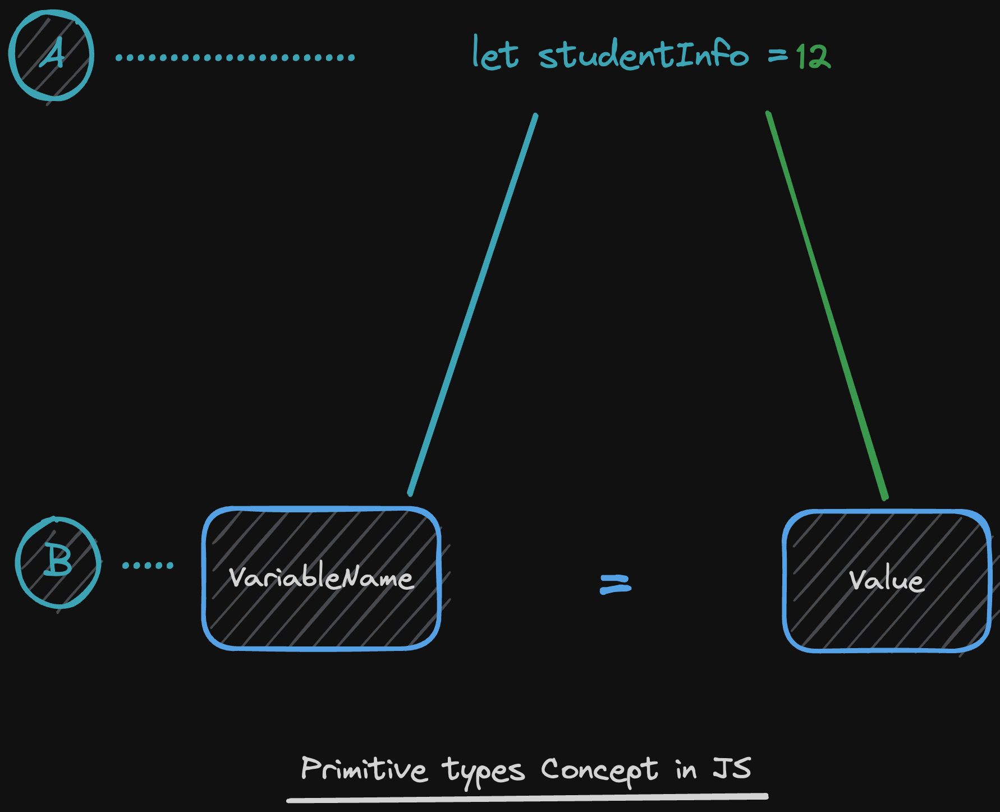
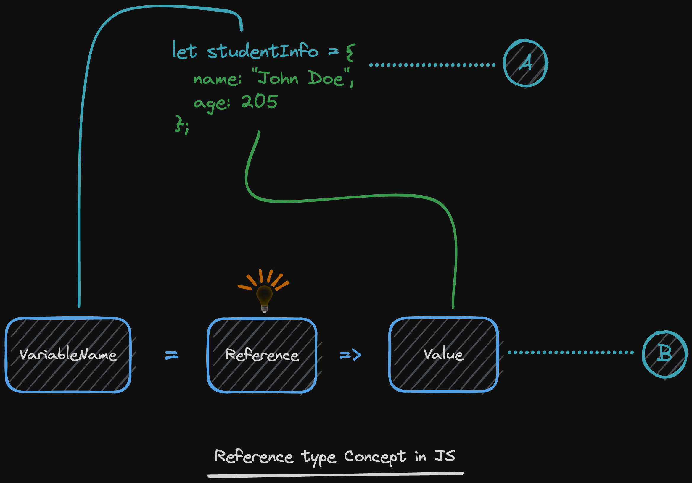
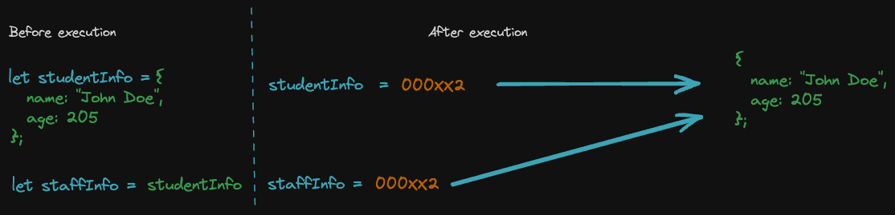
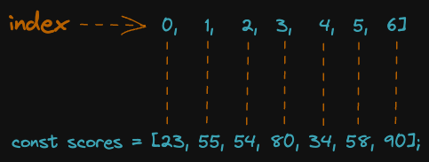
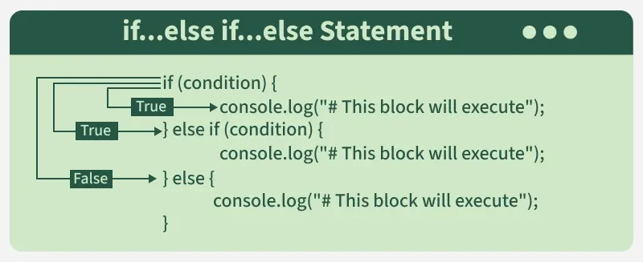
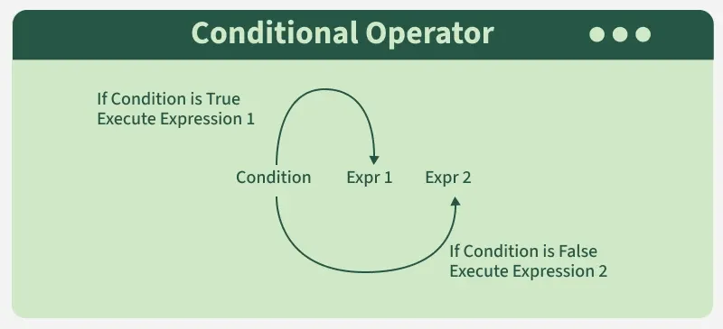

What is JavaScript? A Definition of the JS Programming Language

JavaScript is a dynamic programming language that's used for web development, in web applications, for game development, and lots more. It allows you to implement dynamic features on web pages that cannot be done with only HTML and CSS.

Many browsers use JavaScript as a scripting language for doing dynamic things on the web. Any time you see a click-to-show dropdown menu, extra content added to a page, and dynamically changing element colors on a page, to name a few features, you're seeing the effects of JavaScript.

How JavaScript Makes Things Dynamic
HTML defines the structure of your web document and the content therein. CSS declares various styles for the contents provided on the web document.

HTML and CSS are often called markup languages rather than programming languages, because they, at their core, provide markups for documents with very little dynamism.

JavaScript, on the other hand, is a dynamic programming language that supports Math calculations, allows you to dynamically add HTML contents to the DOM, creates dynamic style declarations, fetches contents from another website, and lots more.

What can a JavaScript Do ?
 JavaScript gives HTML designers a programming tool - HTML authors are normally not 
programmers, but JavaScript is a scripting language with a very simple syntax! Almost anyone can 
put small "snippets" of code into their HTML pages 
 JavaScript can put dynamic text into an HTML page - A JavaScript statement like this: 
document.write("<h1>" + name + "</h1>") can write a variable text into an HTML page 
 JavaScript can react to events - A JavaScript can be set to execute when something happens, 
like when a page has finished loading or when a user clicks on an HTML element 
 JavaScript can read and write HTML elements - A JavaScript can read and change the content 
of an HTML element 
 JavaScript can be used to validate data - A JavaScript can be used to validate form data before 
it is submitted to a server. This saves the server from extra processing 
 JavaScript can be used to detect the visitor's browser - A JavaScript can be used to detect the 
visitor's browser, and - depending on the browser - load another page specifically designed for that 
browser 

  JavaScript can be used to create cookies - A JavaScript can be used to store and retrieve 
information on the visitor's computer.

How to Use JavaScript in HTML
Just like with CSS, JavaScript can be used in HTML in various ways, such as:

1. Inline JavaScript
Here, you have the JavaScript code in HTML tags in some special JS-based attributes.

For example, HTML tags have event attributes that allow you to execute some code inline when an event is triggered. Here's what I mean:

<button onclick="alert('You just clicked a button')">Click me!</button>
This is an example of inline JavaScript. The value of onclick can be some Match calculation, a dynamic addition to the DOM – any syntax-valid JavaScript code.

2. Internal JavaScript, with the script tag
Just like the style tag for style declarations within an HTML page, the script tag exists for JavaScript. Here's how it's used:

3. External JavaScript
You may want to have your JavaScript code in a different file. External JavaScript allows this. For such uses-cases, here's how it's done:

<!-- index.html -->

// script.js
alert("I am inside an external file");
The src attribute of the script tag allows you to apply a source for the JavaScript code. That reference is important because it notifies the browser to also fetch the content of script.js.

script.js can be in the same directory with index.html, or it can be gotten from another website. For the latter, you'll need to pass the full URL (https://.../script.js).

Notice the .js extension? That's the extension for JavaScript files, just like HTML has .html.

Now that we've looked at ways to apply JavaScript to our HTML, let's look at some of the features of JavaScript.

What is a Variable? Example #1
When a child is born, they are given a name and throughout their life, they'll be referred to by that name (unless the name gets changed at some point).

Have you seen anyone without a name? How were you able to call them?
In an ideal world, everyone should have a name or a unique way we can refer to them. In JavaScript, every variable has a name.

Everyone must have a name or a way by which we can refer to them.

What is a Variable? Example #2
In a math equation, when we say x = 1 it means, "anywhere you see x, you should replace it with 1". In this case, x is a variable, while 1 is the value of it. That is: x points to 1.

This means that without x, there will be no reference to 1. There could be other occurrences of 1 in the equation but those will be different than the 1 which x was referring to. For example:

/* The code below means x is 1 
 * So during execution, anywhere x appears after the line below, 
 * the complier replace x with 1.
 */
let x = 1;
let y = 1; // the value which y refers to is different from that of x
console.log(x); // This line will log 1 to the console.
In the code snippet above, x refers to the value 1, and y It also refers to another value 1, but note that both values are distinct, just like you can have two different brands of bottled water even though they both contain water.

So, when we mention the variable name x, we get the value assigned to that variable.

What is a Variable? Example #3
A variable can be conceptualized as a container. The variable's name serves as its identifier, its value represents the container's contents, and its type specifies the nature of those contents.
In JavaScript, values are assigned a name and anytime we need that value, we simply mention the name to which it was assigned. When the code executes, the name of that variable is replaced by the value it refers to.

// Add the line of code below to the previous code snippet to
// find out the data type of x;
console.log(typeof x)

In the code snippet above, number is printed to the console because variable x holds the value 1 which is a number.

Variables exist in our program to help us hold values and be able to refer to them whenever we need to. Anywhere a variable is mentioned, the value of that variable is what's being used for the computation at the time.

How to Declare a Variable
let score;
The program above declares/creates a variable called score.

In JavaScript, creating variables is that simple. The type of the variable is the type of the value stored in it. That is, if the variable score holds a value of 1, the type for the score variable is number. So we can say, score is a number variable.

To create a variable, we have to do the following;

Declare the variable using one of these keywords: let, const or var.

Determine a name to call the variable and write it on the same line as the keyword used in step 1.

let score; // creates variable 'score'
Notice that this time, we did not give it a value. We just simply created a container that will store something. For now, it is empty. Although it has no content at the moment, we'll surely provide content for it.

Variable Assignment and Initialization
We can assign a value to a variable by using the assignment (=) operator—the variable name to the left of it, and the value to the right.

score = 1;
The code snipped above assigns 1 as the value of score (this is called variable assignment).

When we combine variable declaration and assignment in one operation, it is called variable initialization.

let score = 1;
As seen above, we declare the variable score, and immediately on the same line, assign the value 1 to it.

This means that we provided an initial value for the variable when it was created.

How to Call a Variable
If you want to use a variable for an operation at any time in your program, you can simply just "call" it. To call a variable is the same as mentioning or using it.

console.log(score + 1) // 2
In the code snippet above, the variable score was used in the line of code. Therefore, It will be replaced with its actual value 1 during the code execution. This means we'd have 1 + 1 executed, resulting in 2.

In the next section, let's learn how to properly name our variables in other to ensure our codes are neat and readable.

How to Name Variables
Just like naming a human or pet or labeling an object, we always put in much thought to ensure that the name tells a story and gives an idea of how we feel about the role of that pet, human, or object.

JavaScript is somewhat liberal when it comes to how variable naming can be done and also how long it could be.

For example, pneumonoultramicroscopicsilicovolcanoconiosis is a valid variable name in JavaScript even though it is long.

It is generally a good practice to give meaningful names to variables and they should be of a reasonable length.

Let your variables be simple and contextual. For example: author, publishedDate, readTime, shouldCompress, and so on.

It should be self-explanatory. Just avoid cryptic names where possible.

Reserved Words in JavaScript
Even though we can create variables as we wish, some names are already being used within JavaScript to mean something specific. These names cannot be used by a developer to identify a variable. They are called reserved words.

For instance, the keyword catch is used to properly handle an error and prevent it from crashing an application. Hence, you cannot call a variable catch in your program.

Below are all the reserved words in JavaScript:

arguments await break case catch class const continue debugger default delete do else enum eval export extends false finally for function if implements import in Infinity instanceof interface let NaN new null package private protected public return static super switch this throw true try typeof undefined var void while with yield

NOTE: You do not need to memorize these keywords. If you try to use them, you'll get an error and you'll learn to recognize and know them with experience.

Also, JavaScript has some rules that you must follow when naming variables as well as generally accepted conventions (best practices) that you should know about. Let's talk about them in the next section.
Rules for Naming Variables in JavaScript
Reserved words cannot be used as variable names.

The first letter of your variable name should be an alphabet, underscore (_), or a dollar sign ($). You cannot use a number as the first character of your variable name. Even though other kinds of special characters are allowed to start a variable name, as a way of good practice and avoiding complexities at the start, you should just always start with a letter. Using an underscore or dollar sign is symbolic by convention and we'll learn what they mean in the future.

The rest of the variable name may contain anything but symbols, punctuations, and reserved characters (+, -, *, and so on).

Variable names are case-sensitive. This means Boy and boy will be treated as different variables in your program.

A variable name can be as long as is necessary for it to make sense. There is no limit imposed by the language.

Spaces are not allowed in variable names.

Popular Variable Naming Conventions
Variable names with multiple words should use camel casing. That is, the first word has to be all lowercase while the first letter of subsequent words should be uppercase: studentRegistrationNumber

Use uppercase letters for constant variables: const PI = 3.1432

If a constant variable is composed of multiple words, use snake casing (separation of words with an underscore): const PROGRAM_NAME = "Vacation planner"

If a variable is meant to be private, prefix its name with an underscore: let _memorySize = 2042.
Note: This is just to let the team (others working on the project) know that the author intends to use it as private. It doesn't prevent the value of the variable from being accessed (there are other ways to ensure this).

It is common practice to prefix Boolean variables with is or has: let isMarked = true.

In the next section, we'll learn about different data types and how to work with them.

Variable Data Types
Data type simply means "type of data" 😉.

The word "data" in this context means a piece of information. We'll use the word "value" sometimes to mean data and vice versa.

In JavaScript, we store values of different types in variables. These values have different attributes/properties and the type of data a variable holds will determine the operations you can perform with that variable.

For example, if you have water (value) stored in a container (variable), you can use the water (value) to wash or drink, but if what is stored in the container are candies, you can eat them but you won't be able to use them for washing.

If you have a variable that holds numbers, you can use them to perform arithmetic operations. If the variable holds a Boolean, you cannot use it for arithmetic operations but it can be used for logical operations.

💡
The kind of value stored in the variable determines what you can do with it.
The data types in JavaScript are categorized into two primary groups, namely;

Primitive: Number, String, Boolean, Undefined, Null, BigInt, Symbol

Reference: Object, Array, Function

In this article, we will not talk about Symbols and BigInt to avoid complexities. The goal is to do our best to explain fundamental concepts to beginners in the most simple way possible.

Let's consider primitive data types.

Primitive Data Types
Variables having these type of data are called primitives because they hold simple values. The word primitive can be translated to mean non-complex.

Primitive values are usually a single unit like 1, "cup", null, undefined, true, and so on. Let's briefly consider how these data types are used and what kind of operations you can perform with them.

NUMBER: In JavaScript, all numbers are floating-point values. Whether they are numbers without decimal points like a whole number that can be negative, positive, zero, or values with a decimal point like 0.2, -0.5, 1, -2, 0. They are all of the number type.
This type of value can be used in arithmetic operations like multiplication, division, subtraction, addition, modulus, and so on.

let score1 = 2;
let score2 = 5;
let averageScore = (score1 + score2) // 2
console.log(averageScore) // 3.5
To check the data type of a variable's value, use the typeof operator like this: typeof variableName. That is: typeof score1

In the code snippet above, score1 is a variable which holds a value of 2, score2 holds a value of 5, while the averageScore variable stores the result from dividing the sum of score1 and score2 by 2, which evaluates to 3.5.

Using the typeof operator on the score1 variable will return number.

Exercise: Copy the code in the snippet above and run it in your code editor to see how it works for you. You can play around with the values and use the typeof operator to check the variables' data type.

When performing arithmetic operations, you may run into other Number types like Infinity, -Infinity and NaN.

Infinity means something without any limit. One way to reach infinity is to divide a number by 0.

let result = 12 / 0;

console.log(result) // Infinity
In the code above, we divided 12 by 0 and logged the result to the console which prints out Infinity.

Negative Infinity is used to denote a number that is less than any natural number. To arrive at negative infinity, copy the code in the snippet below and run it in your coding environment.

console.log(Number.NEGATIVE_INFINITY) // -Infinity
NaN means Not a Number. This will occur when you try to carry out an impossible mathematical operation as shown below:

const result = "Ella" / 2; // Trying to divide a string with a number
console.log(result) // NaN
The first line in the code above tries to divide a string by a number and the result is NaN.

You will not often reach infinity or -Infinity as a beginner doing basic/intermediate stuff, but it is something you should be aware of so that you do not get worked up when you see it occur in your code (this is something you do not want to cram in your head). NaN is will occur more often than the others. When you see it, just know something is wrong with the operation you are trying to perform.

STRING: In JavaScript, a string is a collection of characters enclosed in quotes: "Cathy".
The snippet below shows how a string can be used in a JavaScript program:

let author = "Sleekcodes";
let publishedDate = "14 August 2023";

console.log("Written by: " + author); // Written by: Sleekcodes
console.log("Published on: " + publishedDate); // Published on: 14 August 2023"
I am sure you noticed the + operator used with strings. When this occurs, the result is that the string on the right and that on the left will be joined together to become one. This is called string concatenation.

The code above is simply saying, "Create a variable called author and store the text "sleekCodes" as its value, create another variable publishedDate and store the text "14 August 2023" in it."

Then in line 4, we tell the JavaScript engine to log (print) the string "Written by: Sleekcodes" to the console. Line 5 also says log "Published on: 14 August 2023" to the console.

Notice that in the code above, during execution, author gets replaced with the value "Sleekcodes" and publishedDate gets replaced with "14 August 2023" where used.

Strings are used to depict or convey data in text/alphabetic format. A string can be made up of zero or more characters. A string that has no character in it is called an empty string. For example: "".

BOOLEAN: When we need to represent data in two possible states only like true/false, on/of, or yes/no, we use Boolean values. The value of a Boolean variable is either true or false.
let isQualified = true

if (isQualified) {
    console.log("Tola is qualified"); // Tola is qualified
}
The code above will print the statement "Tola is qualified", because the value of the variable isQualified is true. That operation is a type of conditional operation. This is where Boolean values shine.

Exercise: Change the value of isQualified to be false and observe what happens.

UNDEFINED: This is both a value and a data type. undefined is used to indicate that a variable has no defined value. For instance, when a variable is declared (let age), and you try to access its value, the result would be undefined.
let age; // note that there is no value assigned to the variable here

console.log(age); // undefined
In the code snippet above, because age isn't given any explicit value, the compiler assigns the value undefined to the variable by default.

Exercise: Use the typeof operator on the variable age and see what you get. Also, assign the value undefined to age and use the typeof operator on it again to see the result.

NULL: Null is a value we can assign to a variable to indicate that it has no value. It is used to represent "empty" or "unknown".
let age = null;

console.log(age); // null
As seen in the code snippet above, instead of letting the compiler assign undefined for us, we explicitly indicate that the variable has no value by assigning the value null to it.

This means age is empty or unknown.

People often get confused about the difference between undefined and null. One is the default value assigned to a variable without an explicit value, while the other (null) is a value assigned to a variable by the programmer deliberately to indicate that the variable is empty. As a rule of thumb, do not assign undefined to a variable, instead use null (the compiler auto-assigns undefined where needed).

Primitive data types have no complexity. They are plain and simple (a single value). This statement will make more sense when you read about how reference types work in the next section.

Consider the image below.

Part A above is the code you write, while Part B is what happens when the code runs. For primitive data types, the value is simply assigned to the variable (it is straightforward).

Primitive values are passed by value (they generate no reference). Do not worry about what this means yet because we'll explain in the next section.

Reference Types in JavaScript
Reference data types are data passed by "reference". A thorough understanding of this statement is crucial throughout your career as a JavaScript developer, so do well to pay close attention to the concept we are about to learn.

Consider the image below carefully.

In the image above, part A is the code you write, while part B is what happens "behind the scenes".

💡
Use the image above to follow through with the following explanation.sa
When you create a variable whose data type is in the reference category (objects, functions, arrays), instead of the value being directly assigned to the variable, a reference is generated for the value and that reference is what gets assigned to the variable.

The reference gets assigned to the variable, but it points to the actual value.

This means that when you try to use the variable anywhere, you are working with the reference to the actual value and anything done to the reference affects the actual value.

Think of it like a middleman between the actual value and the variable name.

Consider the example below:

let studentInfo = {
    name: "John Doe",
    age: 205
}

let staffInfo = studentInfo //6. This means; assign the ref of studentInfo to staffInfo

staffInfo.name = "Lorry Sante" //8. Change the value of name key in the reference which staffInfo holds.

console.log(studentInfo.name) //9. Lorry Sante
💡
Try this: In line 7 and 8, log the value of studentInfo.name and staffInfo.name to the console to see what they are.
You should notice that, changing name in staffInfo object (line 8), causes the name in studentInfo object to change too (as seen in the output of line 9).

In fact, both variables are pointing to the same value technically (see image below);

When we say that a variable is passed by reference, it means that anywhere that variable is used, you are interacting with a reference (that points) to its actual value.

So in the code snippet above, when studentInfo was assigned to staffInfo, we just made staffInfo to store the reference of the studentInfo variable, effectively saying that both staffInfo and studentInfo variables are pointing to the same value.

Therefore, if the reference generated for studentInfo is 000xx2 and it is true that during execution, variables are replaced by whatever they hold, then staffInfo = studentInfo would become staffInfo = 000xx2 during execution, while staffInfo.name would become 000xx2.name.

If we had written studentInfo.name, then during execution, it becomes 000xx2.name, it should be clear now that both studentInfo and staffInfo holds references to one value. They are like different roads to one destination.

💡
If this is your first time learning this concept, you should repeat the section above before you proceed. It will become clearer and when we start operating with reference types, you'll be glad you read this article.
There are three main reference data types that you'll mostly come across in your journey as a JavaScript developer: Object, Array, and Function. Let's look into them one after the other.

OBJECT: An object is a data structure used to store complex data in key/value pairs. The variable created in the previous session has an object type like this:
let studentInfo = {
    name: "John Doe",
    age: 205
}
You can see that it isn't primitive (simple). Unlike primitive types with just simple values, an object can be used to store different information which can be made up of even primitive and reference types.

Objects store data in key/value pairs like so: {key: value}

In the code snippet above, name is key, while "John Doe" is its value. Also, age is key, while 205 is its value.

If you notice, both name and age have primitive values (string and number).

To access the value of an object, we use the object name, dot (.) notation, and the key whose value we want to access. For example: objectName.key.

Objects can also contain nested objects like so:

let studentInfo = {
    name: "John Doe",
    age: 205,
    beneficiary: {
       name: "Tira Doe",
       age: 200,
       relationship: "Wife"
    }
}
In the above example, the studentInfo object has a nested object called beneficiary. beneficiary is a key whose value is an object (reference type). Objects can still hold arrays and functions too.

Accessing the value associated with a key in an object within another object (nested object) is natural. We simply use dot notation. Like so: parentObjectName.nestedObjectName.key

For example, to access the name of the beneficiary in studentInfo object above, we simply write studentInfo.beneficiary.name.

💡
There's no limit to nesting objects in objects. However, ensure that nesting is necessary for what you want to achieve and too much nesting should be avoided for simplicity.
This is not all that you need to know about objects but it is a very sound way to start.

ARRAY: An array is a kind of object but stores data using automatically assigned indexes instead of keys.
An array is created by writing a comma-separated list of values enclosed with square brackets: [0, 1, 2, 3, "Tosin", "Mike", {name: "Abel Joe", age: 250}]

If you pay close attention to the values used in the array above, you'll notice that they are of different data types. Yes, arrays also allow you to store values of different types in one place but this is strongly discouraged (you shouldn't do it at all). The values in an array should all be of the same type.

Example of a proper array: let scores = [1, 3, 5, 6, 9, 12]

To access a value in an array, we simply specify the array name, followed by a square bracket [] without any space between the name and the bracket. Then inside the square bracket, provide the index of the value you wish to access. That is: arrayName[index].

What's an index and how do we know what index refers to the value we want to access?

An index is simply a number automatically assigned to an array value. You can think of it as an address for values in the array. Arrays are 0 indexed (meaning they start counting from zero).

To determine the index of the value you wish to access, start counting from the start of the array and your count should start from 0.

Consider the image below;

To access the value 80 in the scores array depicted in the image above, we simply write scores[3]

There is a lot you can do with arrays as a JavaScript developer. For now, this is a simple introduction to the array data type.

FUNCTION: A function is a different kind of variable and it's declared differently (using the function keyword instead of let, const or var). It is a construct used to carry out a specific task.
For example, if you need to add two numbers together multiple times within your code, it's best practice to create a dedicated function for this task. By reusing this function, you avoid redundant code and improve code maintainability compared to repeatedly writing the addition logic. Wait!!! You are not lost. The example below will confirm this 😊

Scenario 1 (without function):
let num1 = 2;
let num2 = 3;
let result = num1 + num2;

console.log(result) // 5

let num3 = 3;
let num4 = 8;
let result2 = num3 + num4;

console.log(result2) // 11
Scenario 2 (with function):

// function declaration.
function addNumbers (num1, num2) {
    return num1 + num2;
}

console.log(addNumbers(2, 3)); // 5
console.log(addNumbers(3, 8)); // 11
You will agree that, scenario 2 contains less code, looks neater, and even feels more natural.

Functions allow us write helpers that we can call to get a specific job done for us any time we want. We just have to tell it how to do the job once and call it anytime we need it to do that job (passing in any information required for the task as arguments) and it delivers.

Function Syntax:

To write a function, we use the function keyword, followed by the name of the function: functionName, a pair of brackets (), and a pair of curly braces {}.

function functionName () {}
There are a few things/conventions you should have in mind when writing functions:

Function names should follow the same naming rules as variables.

Function names should be verbs (to depict an action).

The code logic for the actual task should be written between the opening { and closing } curly braces.

If there are values required to carry out the task, they should be passed into the function as arguments. In this case, during the function declaration, parameters should be stated between the opening ( and closing ) brackets in a comma-separated fashion. That is: function addNumbers(num1, num2)....

If no data is required to carry out the task, then the opening ( and closing ) brackets should be left empty: function sayHi()....

A parameter is a variable defined between the opening ( and closing ) of a function during its declaration: function doSomething (param1, param2) {...}.

An argument is the value passed into the function during its invocation/call: doSomething(1, 2)

As seen above, to call/invoke a function, write the function name, followed by an opening and a closing bracket (without any whitespace). Required arguments should be provided between the opening and closing brackets (if any).

To drive this concept home, let's create a function to multiply two digits:

//        functionName   param1 param2
function multiplyNumbers (num1, num2) {
    return num1 * num2; // task to carry out.
}
It's as simple as that.

Having done that, let's call/invoke the function.

multiplyNumbers(2, 3) // 6
Notice that while creating the function, we declared two parameters: num1 and num2. When calling the function, we assigned values to the two arguments: 1 and 2.

return keyword

Functions may return values or not.

If a function contains a return statement, like the multiplyNumbers function, then it will return a value if everything goes well. If there is no return statement for the function, it will return undefined.

function sayHi () {
    console.log("Hi");
}
If we invoke sayHi, it would log the text Hi to the console and it will also return undefined.

Remember that functions are like helpers, when you send a helper to carry out an assignment, you may require them to give you feedback (the result of the task they carried out) or you may not need feedback.

If you need feedback, add a return statement about what feedback you need. Otherwise, do not add a return statement to the function.

There is still a lot to learn about every data type we have highlighted in this article so take your time to practice these basics and when you feel comfortable enough using them, you'll see the need to dive deeper.

Summary
Variables are "pointers" to values. When you mention (use) a variable anywhere in your code, the variable identifier (name) is replaced with the value it points to. It's just like calling someone's name. The name doesn't respond, the person (value) behind the name is what you hope to get as a response.

By way of retention, do not try to cram all these rules and conventions. Feel free to refer back to this article when programming and in a short amount of time, you'll be used to all of them and you won't need to refer to any article ever again to name your variables properly.

If you should have anything in mind, remember to start variables with a lowercase letter if the variable is made of multiple words, subsequent words should start with uppercase letters. That is: age, dateOfBirth.

To create a variable, use the keyword let, const, or var, followed by the variable name. If you wish to initialize the variable, then on the same line before the semi-colon, input the assignment operator and variable value after it.

For example: let score; or let score = 3; (if you wish to initialize during declaration).

If you wish to use a variable, just mention its name and the value will be used during the execution of your code.

let a = 2;
let b = 3;
console.log(a + b) // 4

Arithmetic operators
Arithmetic operators are used for performing mathematical calculations in JavaScript:

Operator	Name	Purpose	Example
+	Addition	Adds two numbers together.	6 + 9
-	Subtraction	Subtracts the right number from the left.	20 - 15
*	Multiplication	Multiplies two numbers together.	3 * 7
/	Division	Divides the left number by the right.	10 / 5
%	Remainder (sometimes called modulo)	
Returns the remainder left over after you've divided the left number into a number of integer portions equal to the right number.

8 % 3 (returns 2, as three goes into 8 twice, leaving 2 left over).

**	Exponent	Raises a base number to the exponent power, that is, the base number multiplied by itself, exponent times.	5 ** 2 (returns 25, which is the same as 5 * 5).
Note: You'll sometimes see numbers involved in arithmetic referred to as operands.

Note: You may sometimes see exponents expressed using the older Math.pow() method, which works in a very similar way. For example, in Math.pow(7, 3), 7 is the base and 3 is the exponent, so the result of the expression is 343. Math.pow(7, 3) is equivalent to 7**3.

We probably don't need to teach you how to do basic math, but we would like to test your understanding of the syntax involved. Try entering the examples below into your developer tools JavaScript console to familiarize yourself with the syntax.

First try entering some simple examples of your own, such as

js

Copy
10 + 7;
9 * 8;
60 % 3;
You can also try declaring and initializing some numbers inside variables, and try using those in the sums — the variables will behave exactly like the values they hold for the purposes of the sum. For example:

js

Copy
const num1 = 10;
const num2 = 50;
9 * num1;
num1 ** 3;
num2 / num1;
Last for this section, try entering some more complex expressions, such as:

js

Copy
5 + 10 * 3;
(num2 % 9) * num1;
num2 + num1 / 8 + 2;
Parts of this last set of calculations might not give you quite the result you were expecting; the section below might well give the answer as to why.

Operator precedence
Let's look at the last example from above, assuming that num2 holds the value 50 and num1 holds the value 10 (as originally stated above):

js

Copy
num2 + num1 / 8 + 2;
As a human being, you may read this as "50 plus 10 equals 60", then "8 plus 2 equals 10", and finally "60 divided by 10 equals 6".

But the browser does "10 divided by 8 equals 1.25", then "50 plus 1.25 plus 2 equals 53.25".

This is because of operator precedence — some operators are applied before others when calculating the result of a calculation (referred to as an expression, in programming). Operator precedence in JavaScript is the same as is taught in math classes in school — multiply and divide are always done first, then add and subtract (the calculation is always evaluated from left to right).

If you want to override operator precedence, you can put parentheses around the parts that you want to be explicitly dealt with first. So to get a result of 6, we could do this:

js

Copy
(num2 + num1) / (8 + 2);
Try entering the previous line into the console to test this out.

Note: A full list of all JavaScript operators and their precedence can be found in Operator precedence.

Increment and decrement operators
Sometimes you'll want to repeatedly add or subtract one to or from a numeric variable value. This can be conveniently done using the increment (++) and decrement (--) operators. We used ++ in our "Guess the number" game back in our first splash into JavaScript article, when we added 1 to our guessCount variable to keep track of how many guesses the user has left after each turn.

js

Copy
guessCount++;
Let's try playing with these in your console. For a start, note that you can't apply these directly to a number, which might seem strange, but we are assigning a variable a new updated value, not operating on the value itself. The following will return an error:

js

Copy
3++;
So, you can only increment an existing variable. Try this:

js

Copy
let num1 = 4;
num1++;
Okay, strangeness number 2! When you do this, you'll see a value of 4 returned — this is because the browser returns the current value, then increments the variable. You can see that it's been incremented if you return the variable value again:

js

Copy
num1;
The same is true of -- : try the following

js

Copy
let num2 = 6;
num2--;
num2;
Note: You can make the browser do it the other way round — increment/decrement the variable then return the value — by putting the operator at the start of the variable instead of the end. Try the above examples again, but this time use ++num1 and --num2.

Assignment operators
Assignment operators are operators that assign a value to a variable. We have already used the most basic one, =, many times — it assigns the variable on the left the value stated on the right:

js

Copy
let x = 3; // x contains the value 3
let y = 4; // y contains the value 4
x = y; // x now contains the same value y contains, 4
But there are some more complex types, which provide useful shortcuts to keep your code neater and more efficient. The most common are listed below:

Operator	Name	Purpose	Example	Shortcut for
+=	Addition assignment	Adds the value on the right to the variable value on the left, then returns the new variable value	x += 4;	x = x + 4;
-=	Subtraction assignment	Subtracts the value on the right from the variable value on the left, and returns the new variable value	x -= 3;	x = x - 3;
*=	Multiplication assignment	Multiplies the variable value on the left by the value on the right, and returns the new variable value	x *= 3;	x = x * 3;
/=	Division assignment	Divides the variable value on the left by the value on the right, and returns the new variable value	x /= 5;	x = x / 5;
Try typing some of the above examples into your console, to get an idea of how they work. In each case, see if you can guess what the value is before you type in the second line.

Note that you can quite happily use other variables on the right-hand side of each expression, for example:

js

Copy
let x = 3; // x contains the value 3
let y = 4; // y contains the value 4
x *= y; // x now contains the value 12
Comparison operators
Sometimes we will want to run true/false tests, then act accordingly depending on the result of that test — to do this we use comparison operators.

Operator	Name	Purpose	Example
===	Strict equality	Tests whether the left and right values are identical to one another	5 === 2 + 4
!==	Strict-non-equality	Tests whether the left and right values are not identical to one another	5 !== 2 + 3
<	Less than	Tests whether the left value is smaller than the right one.	10 < 6
>	Greater than	Tests whether the left value is greater than the right one.	10 > 20
<=	Less than or equal to	Tests whether the left value is smaller than or equal to the right one.	3 <= 2
>=	Greater than or equal to	Tests whether the left value is greater than or equal to the right one.	5 >= 4
Note: You may see some people using == and != in their tests for equality and non-equality. These are valid operators in JavaScript, but they differ from ===/!==. The former versions test whether the values are the same but not whether the values' datatypes are the same. The latter, strict versions test the equality of both the values and their datatypes. The strict versions tend to result in fewer errors, so we recommend you use them.

If you try entering some of these values in a console, you'll see that they all return true/false values — those booleans we mentioned in the last article. These are very useful, as they allow us to make decisions in our code, and they are used every time we want to make a choice of some kind. For example, booleans can be used to:

Display the correct text label on a button depending on whether a feature is turned on or off
Display a game over message if a game is over or a victory message if the game has been won
Display the correct seasonal greeting depending on what holiday season it is
Zoom a map in or out depending on what zoom level is selected
We'll look at how to code such logic when we look at conditional statements in a future article. For now, let's look at a quick example:

html

Copy
Play
<button>Start machine</button>

The machine is stopped.

js

Copy
Play
const btn = document.querySelector("button");
const txt = document.querySelector("p");

btn.addEventListener("click", updateBtn);

function updateBtn() {
  if (btn.textContent === "Start machine") {
    btn.textContent = "Stop machine";
    txt.textContent = "The machine has started!";
  } else {
    btn.textContent = "Start machine";
    txt.textContent = "The machine is stopped.";
  }
}
Play

You can see the equality operator being used just inside the updateBtn() function. In this case, we are not testing if two mathematical expressions have the same value — we are testing whether the text content of a button contains a certain string — but it is still the same principle at work. If the button is currently saying "Start machine" when it is pressed, we change its label to "Stop machine", and update the label as appropriate. If the button is currently saying "Stop machine" when it is pressed, we swap the display back again.

Note: Such a control that swaps between two states is generally referred to as a toggle. It toggles between one state and another — light on, light off, etc.

JavaScript Control Flow Statements
Last Updated : 5 May, 2026
Control flow statements in JavaScript control the order in which code is executed. These statements allow you to make decisions, repeat tasks, and jump between parts of a program based on specific conditions.

JavaScript if Statement
The if statement executes a block of code only if a specified condition is true.

const age = 18;
if (age >= 18) {
    console.log("You are an adult.");
}
Checks if age is greater than or equal to 18.
Logs "You are an adult." if the condition is true.
JavaScript if...else Statement
The if...else statement provides an alternate block of code to execute if the condition is false.

const score = 40;
if (score >= 50) {
    console.log("You passed.");
} else {
    console.log("You failed.");
}
It will log "You passed." if the score is 50 or more.
Otherwise, logs "You failed."
JavaScript if...else if...else Statement
The if...else if...else statement is used when you want to handle multiple conditions.

const temp = 25;
if (temp > 30) {
    console.log("It's hot.");
} else if (temp >= 20) {
    console.log("It's warm.");
} else {
    console.log("It's cold.");
}
Checks if the temperature is greater than 30, logs "It's hot."
If not, checks if it's between 20 and 30, logs "It's warm."
Otherwise, logs "It's cold."
JavaScript Switch Statement
The switch statement evaluates an expression and executes a block of code based on matching cases. It provides an alternative to long if-else chain.

const day = "Monday";
switch (day) {
    case "Monday":
        console.log("Start of the week.");
        break;
    case "Friday":
        console.log("End of the workweek.");
        break;
    default:
        console.log("It's a regular day.");
}
Checks the value of day and matches it to a case.
Logs "Start of the week." if day is "Monday".
Logs "End of the workweek." if day is "Friday".
Logs "It's a regular day." if no cases match.
Note: Without break, execution continues to the next case statements (fall-through behavior).

JavaScript Looping Statements
Looping statements are used to execute a block of code repeatedly based on a condition.

1. JavaScript for Loop
The for loop is used when the number of iterations is known.

Loading Playground...
for (let i = 1; i <= 3; i++) {
    console.log(i);}

    Initializes a counter, checks condition, and updates it in each iteration.
Executes the block until the condition becomes false.
2. JavaScript while Loop
The while loop runs as long as the condition is true.

let i = 1;
while (i <= 3) {
    console.log(i);
    i++;
}
Checks the condition before each iteration.
Executes the block only if the condition is true.
3. JavaScript do...while Loop
The do...while loop executes the block at least once, even if the condition is false.

let i = 1;
do {
    console.log(i);
    i++;
} while (i <= 3);
Executes the block first, then checks the condition.
Ensures at least one execution.
Ternary Operator or Conditional Operator
In some programming languages, a ternary operator is used to assign a value to a variable based on a condition.

let a = 10;
console.log(a === 5 ? "a is equal to 5" : "a is not equal to 5");

let a = 10; assigns the value 10 to variable a.
a === 5 ? ... : ... checks if a is strictly equal to 5.
Returns "a is equal to 5" if true.
Returns "a is not equal to 5" if false.
Uses of Control Flow Statements
Control flow statements are backbone in programming for

Decision-Making: To execute specific blocks of code based on conditions (e.g., if, if...else).
Branching: To exit loops or skip iterations (break, continue).
Looping: To repeat tasks (for, while, do...while).
Switching: To handle multiple conditions effectively (switch).