# 🟩 Module 02 — Node.js Fundamentals

> 👋 **Welcome to the server side!**
> You've mastered JavaScript in the browser. Now we take the same language and run it on a machine — handling files, networks, databases, and requests. This is where backend development begins.
> Every major company — Netflix, Uber, PayPal, LinkedIn, NASA — runs Node.js in production. Let's learn why.

---

## 📖 Table of Contents

1. [What is Node.js?](#1--what-is-nodejs)
2. [How Node.js Works — V8, libuv & the Runtime](#2--how-nodejs-works)
3. [Node.js vs the Browser](#3--nodejs-vs-the-browser)
4. [Installing Node.js & Running Your First App](#4--installing-nodejs--running-your-first-app)
5. [The Module System](#5--the-module-system)
6. [Global Scope in Node.js](#6--global-scope-in-nodejs)
7. [NPM & Package Management](#7--npm--package-management)
8. [The File System (fs) Module](#8--the-file-system-fs-module)
9. [The Event Loop — Deep Dive](#9--the-event-loop--deep-dive)
10. [Environment Variables & .env](#10--environment-variables--env)
11. [Building an HTTP Server](#11--building-an-http-server)
12. [Error Handling](#12--error-handling)
13. [Debugging Node.js](#13--debugging-nodejs)
14. [Timers Module](#14--timers-module)
15. [Crypto Module](#15--crypto-module)
16. [Child Processes](#16--child-processes)
17. [Working with JSON](#17--working-with-json)
18. [Streams & Buffers](#18--streams--buffers)
19. [Learning Resources](#19--learning-resources)
20. [Quick Knowledge Check](#20--quick-knowledge-check)

---

## 1 — What is Node.js?


> **"Node.js is an open-source, cross-platform JavaScript runtime environment."**
> — nodejs.dev docs

Let's break that down because it's dense for a beginner:

- **Open-source** — the source code is publicly available, maintained by contributors worldwide
- **Cross-platform** — runs on Linux, macOS, and Windows without changing your code
- **JavaScript runtime environment** — a software environment that can execute JavaScript code

### 🤔 But wait — didn't JavaScript already run somewhere?

Yes — in the browser! Browsers like Chrome have a built-in JavaScript engine (V8) that runs JS to make websites interactive. But before Node.js, JavaScript could **only** run inside a browser.

**Node.js changed everything.** It took the V8 engine out of Chrome and let it run on a server — outside any browser. Now you can use the same JavaScript you know to:

- Handle HTTP requests
- Read and write files
- Connect to databases
- Build REST APIs
- Run scheduled tasks
- Process real-time data

> 💡 **Fun Fact:** Node.js was created in 2009 by Ryan Dahl. He was frustrated that Apache HTTP Server (the dominant server at the time) couldn't handle many concurrent connections efficiently. Node.js solved that.

---

### Why Should You Learn Node.js?

| Reason | Detail |
|---|---|
| 🔁 One language everywhere | Same JavaScript for frontend AND backend |
| ⚡ High performance | Built on Google's V8 engine — the same engine that powers Gmail |
| 📦 Massive ecosystem | npm has over **2 million packages** — the largest software registry in the world |
| 💼 In-demand | Netflix, Uber, PayPal, LinkedIn, Walmart all use it in production |
| 🌐 Real-time ready | Perfect for chat apps, live notifications, collaborative tools |
| 👥 Vibrant community | Millions of developers, endless tutorials, quick solutions to any problem |

---

## 2 — How Node.js Works

Understanding how Node.js works under the hood will make you a better developer. Let's break it into three parts:

### 🔧 The V8 Engine


V8 is Google's open-source JavaScript engine, written in C++. It's what powers Chrome — and Node.js. V8 does two things:

**1. Memory Heap** — When you create a variable, V8 allocates memory for it:
```js
let value = 123;
// V8 allocates memory for "value" and stores 123 there
// When you use "value" in code, V8 fetches 123 from that memory location
```

**2. Call Stack** — Tracks what function is currently running and what to run next. JavaScript is **single-threaded** — one call stack, one thing at a time, following Last-In-First-Out (LIFO) order:

```js
function add(a, b) { return a + b; }
function calculate() { return add(5, 3); }
calculate();

// Call stack trace:
// 3. add(5, 3)     ← runs, pops off
// 2. calculate()   ← runs, pops off
// 1. main script   ← runs, pops off
```

---

### ⚙️ libuv — The Secret Weapon

Node.js isn't doing all the heavy work alone. It delegates slow operations to **libuv** — a C library that manages a **thread pool** in the background.

Operations that go to libuv's thread pool:
- File system reads/writes
- DNS lookups
- Crypto operations (hashing, encryption)
- Compression

While libuv handles these in the background, the main JavaScript thread stays free to handle more requests. This is what makes Node.js fast even though it's single-threaded.

---

### 🔄 The Event Loop

The event loop is what allows Node.js to handle thousands of concurrent requests on a single thread. Think of it as a **traffic controller** that never stops watching for completed tasks.

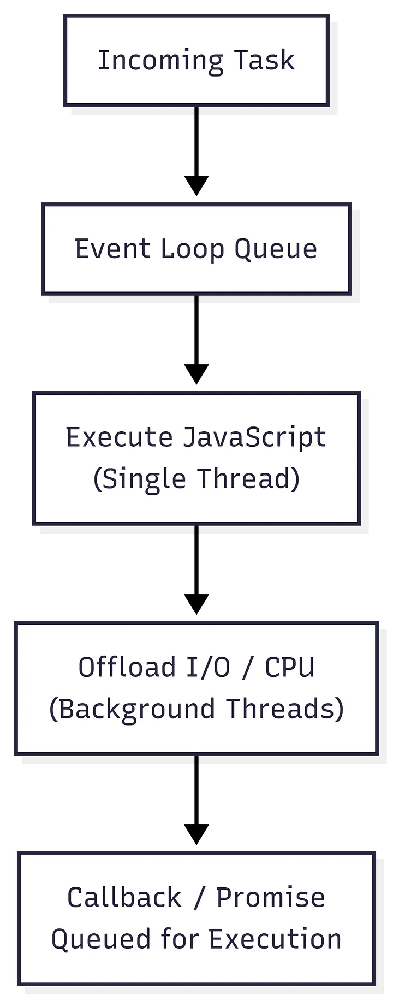

Here's the simplified flow:

```
┌──────────────────────────────────────────────┐
│  Your JS Code runs on the Call Stack         │
│  (one thing at a time)                       │
└──────────────────┬───────────────────────────┘
                   │ slow async task? (file read, network)
                   ▼
┌──────────────────────────────────────────────┐
│  Node/libuv APIs handle it in background     │
└──────────────────┬───────────────────────────┘
                   │ task completes
                   ▼
┌──────────────────────────────────────────────┐
│  Callback Queue (waits here)                 │
└──────────────────┬───────────────────────────┘
                   │ Call Stack is empty?
                   ▼
┌──────────────────────────────────────────────┐
│  Event Loop moves callback to Call Stack     │
└──────────────────────────────────────────────┘
```

```js
console.log("1 - Start");

setTimeout(() => {
  console.log("3 - Timeout (async)");
}, 0); // Even 0ms delay — it's still async!

console.log("2 - End");

// Output:
// 1 - Start
// 2 - End
// 3 - Timeout (async)  ← always after synchronous code
```

> 🧠 Even with `0ms` delay, `setTimeout` goes to the callback queue. The event loop only moves it to the call stack after all synchronous code has finished. This is the event loop in action.

---

### 📋 Event Loop Phases

The event loop processes callbacks in a specific order — think of it like a train making stops in sequence:

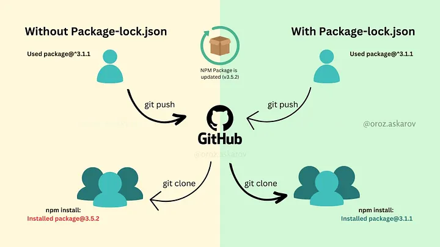

```
┌──────────────────────────────────────────┐
│  1. Timers          setTimeout/setInterval │
│  2. Pending I/O     System-level callbacks │
│  3. Poll            Wait for & run I/O    │
│  4. Check           setImmediate           │
│  5. Close Callbacks Socket closes etc.    │
└──────────────────────────────────────────┘
         ↑ Microtasks run between EVERY phase
         (Promise.then, process.nextTick)
```

**Microtasks** (Promises, `process.nextTick`) have the **highest priority** — they run after every single operation, before the loop moves to the next phase.

```js
const fs = require('fs');

fs.readFile('file.txt', () => {
  setTimeout(() => console.log("setTimeout"),  0);
  setImmediate(() => console.log("setImmediate"));
});

// Output (when inside an I/O callback):
// setImmediate   ← check phase comes before timers phase loops back
// setTimeout
```

---

### ⚠️ Blocking the Event Loop (The #1 Mistake)

Because JavaScript is single-threaded, **any CPU-heavy synchronous code blocks everything**:

```js
function heavyComputation() {
  let sum = 0;
  for (let i = 0; i < 10_000_000_000; i++) { // 10 billion iterations!
    sum += i;
  }
  return sum;
}

setTimeout(() => console.log("I'll never run on time"), 0);
heavyComputation(); // Blocks the event loop for seconds
```

**What you expect:** Timer executes immediately after.
**What actually happens:** Timer waits until the entire loop finishes. Server is frozen the whole time.

While `heavyComputation()` runs, **no requests can be handled, no timers fire, nothing moves**. Your entire server freezes.

```js
// ❌ Blocking — freezes everything
const data = fs.readFileSync('./bigfile.txt');

// ✅ Non-blocking — event loop stays free
fs.readFile('./bigfile.txt', (err, data) => {
  console.log(data);
});
```

---

### 🛠️ Designing for Heavy Load — Production Patterns

**Pattern 1 — Break CPU tasks into chunks using `setImmediate`:**

```js
function chunkedTask(items, chunkSize = 1000) {
  function processChunk() {
    const chunk = items.splice(0, chunkSize);
    chunk.forEach(doWork);

    if (items.length > 0) {
      setImmediate(processChunk); // yield to event loop between chunks
    }
  }
  processChunk();
}
```

Instead of processing 1 million items in one synchronous block, we process 1000 at a time and hand control back to the event loop between each chunk. Other requests stay responsive.

**Pattern 2 — Worker Threads for CPU-heavy work:**

```js
const { Worker, isMainThread, parentPort, workerData } = require('worker_threads');

if (isMainThread) {
  // Main thread — spawn a worker
  const worker = new Worker(__filename, { workerData: { input: 42 } });
  worker.on('message', result => console.log('Result:', result));
  worker.on('error',   err    => console.error('Worker error:', err));
} else {
  // Worker thread — do the heavy work here
  const result = workerData.input * 2; // simulate CPU work
  parentPort.postMessage(result);
}
```

Use Worker Threads for: image processing, AI inference, data aggregation, encryption at scale.

**Pattern 3 — Backpressure (reject early, fail fast):**

```js
const MAX_QUEUE = 100;
let queue = [];

server.on('request', (req, res) => {
  if (queue.length > MAX_QUEUE) {
    res.statusCode = 503;
    return res.end('Server is busy. Try again later.');
  }
  // process request normally
});
```

Rejecting a request with a `503` is infinitely better than silently queuing it until memory runs out and the server crashes.

**Detecting event loop lag in production:**

```js
const start = process.hrtime.bigint();

setImmediate(() => {
  const delay = Number(process.hrtime.bigint() - start) / 1e6;
  console.log(`Event loop delay: ${delay.toFixed(2)}ms`);
  // < 10ms  : Healthy
  // 50-100ms: Warning
  // 200ms+  : Severe degradation
});
```

**libuv Thread Pool Saturation:**

Node.js uses a default thread pool of only **4 threads** for file system, DNS, crypto operations. Under heavy load:

```js
const crypto = require('crypto');

// Only 4 of these run at once — the rest queue
for (let i = 0; i < 10; i++) {
  crypto.pbkdf2('password', 'salt', 100000, 64, 'sha512', () => {
    console.log('Done', i);
  });
}
```

You can increase the thread pool size with an environment variable:
```bash
UV_THREADPOOL_SIZE=8 node server.js
```

> 🧠 **Key insight:** `async` does not mean non-blocking at scale. Once your thread pool is saturated, async file/crypto operations queue just like synchronous ones. Understanding this separates beginner Node.js developers from production-ready ones.

---

## 3 — Node.js vs the Browser

Both run JavaScript — but they're different environments:

| Feature | Browser | Node.js |
|---|---|---|
| DOM access | ✅ Yes (`document`, `window`) | ❌ No |
| File system access | ❌ No | ✅ Yes (`fs` module) |
| Global object | `window` | `global` |
| HTTP servers | ❌ No | ✅ Yes (`http` module) |
| Module system | ES Modules (`import`) | CommonJS (`require`) + ES Modules |
| Version control | User's browser version | You choose |
| Networking | Limited (fetch API) | Full TCP/UDP access |

```js
// Browser — global is window
window.console.log("hello");
var x = 5;
console.log(window.x); // 5 — var leaks to window in browsers

// Node.js — global is global
global.console.log("hello");
var x = 5;
console.log(global.x); // undefined — var is file-scoped in Node!
```

> 🧠 In Node.js, each file is treated as its own **module**. Variables declared with `var` inside a file are scoped to that file, not the global object. This is a key difference from browser behavior.

---

## 4 — Installing Node.js & Running Your First App

### Step 1 — Download & Install

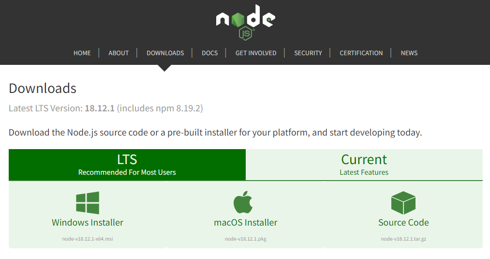

Go to [nodejs.org](https://nodejs.org) and download the **LTS (Long Term Support)** version — this is the stable, production-ready version.

### Step 2 — Verify Installation

```bash
node --version   # e.g. v20.11.0
npm --version    # e.g. 10.2.4
```


### Step 3 — Run Your First Script

Create a folder `my-project`, open it, and create `app.js`:

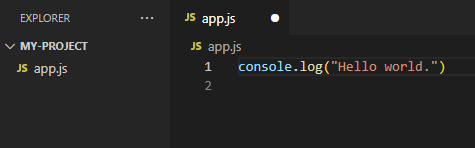

```js
// app.js
console.log("Hello, Node.js!");
console.log("I am running on the server!");
```

Run it from the terminal:

```bash
node app.js
```

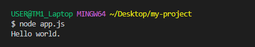

You should see:
```
Hello, Node.js!
I am running on the server!
```

🎉 You just ran your first Node.js application!

### The Node.js REPL

Node also has an interactive shell (REPL — Read, Evaluate, Print, Loop). Just type `node` in your terminal:

```bash
$ node
> 2 + 2
4
> "hello".toUpperCase()
'HELLO'
> const name = "Marta"
> `Hello, ${name}!`
'Hello, Marta!'
> .exit     // or Ctrl+C twice to quit
```

Great for quick experiments without creating a file.

---

## 5 — The Module System

### 🧩 What is a Module?

A **module** is simply a file. In Node.js, every file is its own module — variables and functions defined in one file are **not** automatically available in another. You must explicitly export and import them.

This prevents naming collisions and keeps code organized. Think of modules like rooms in a building — each room has its own contents. To share something between rooms, you pass it through a door (export/import).

---

### Built-in Modules

Node.js ships with built-in modules — no installation needed:

| Module | Purpose |
|---|---|
| `fs` | File system — read, write, delete files |
| `http` | Create HTTP servers and make requests |
| `path` | Work with file paths across operating systems |
| `os` | Info about the operating system (CPU, memory, etc.) |
| `events` | Create and listen to custom events |
| `crypto` | Encryption, hashing, security |
| `url` | Parse and format URLs |

```js
const os = require('os');
console.log(os.platform());   // "linux", "darwin", or "win32"
console.log(os.cpus().length); // Number of CPU cores
console.log(os.freemem());    // Free memory in bytes
```

---

### CommonJS Modules (Default in Node.js)

**Exporting** from a file:

```js
// math.js
function add(a, b) { return a + b; }
function subtract(a, b) { return a - b; }
const PI = 3.14159;

module.exports = { add, subtract, PI };
```

**Importing** in another file:

```js
// app.js
const { add, subtract, PI } = require('./math');

console.log(add(5, 3));      // 8
console.log(subtract(10, 4)); // 6
console.log(PI);              // 3.14159
```

> 📝 The `./` prefix means "look in the current folder." Without it, Node looks in `node_modules` for installed packages.

---

### ES Modules (Modern Syntax)

To use `import`/`export` in Node.js, either:
- Name the file `.mjs`, or
- Add `"type": "module"` to your `package.json`

```js
// math.mjs
export function add(a, b) { return a + b; }
export const PI = 3.14159;
export default function multiply(a, b) { return a * b; }
```

```js
// app.mjs
import multiply, { add, PI } from './math.mjs';
console.log(add(2, 3));      // 5
console.log(multiply(4, 5)); // 20
```

| | CommonJS | ES Modules |
|---|---|---|
| Syntax | `require()` / `module.exports` | `import` / `export` |
| Loading | Synchronous | Asynchronous |
| Default in Node.js | ✅ Yes | Needs config |
| Used in | Most Node.js projects | Modern projects |

---

### How the Module Object Looks

Run `console.log(module)` in any Node.js file to see the module object:

```js
{
  id: '.',
  path: '/home/projects/my-app',
  exports: {},
  filename: '/home/projects/my-app/app.js',
  loaded: false,
  children: [],
  paths: [
    '/home/projects/my-app/node_modules',
    '/home/projects/node_modules',
    '/home/node_modules',
    '/node_modules'
  ]
}
```

This is Node.js's internal representation of your file. `exports` starts empty — you populate it with what you want to share.

---

## 6 — Global Scope in Node.js

In the browser, `var` declarations automatically become properties of `window`. In Node.js, this doesn't happen — each file has its own scope.

```js
// Browser
var userName = "Collin";
window.console.log(window.userName); // "Collin" — var leaks to window

// Node.js
var userName = "Collin";
global.console.log(global.userName); // undefined — scoped to the file/module
```

**Why?** In Node.js, your code is automatically wrapped in a function:

```js
// What Node actually runs behind the scenes:
(function(exports, require, module, __filename, __dirname) {
  // YOUR CODE IS HERE
  var userName = "Collin"; // scoped to this function, not global
});
```

This wrapper is why:
- `var` declarations don't leak to `global` in Node (they're inside this function)
- Every file automatically gets `exports`, `require`, `module`, `__filename`, `__dirname`
- Each file is truly isolated from every other file by default

You can see that these are injected arguments:

```js
console.log(__filename); // Full absolute path to this file
console.log(__dirname);  // Directory containing this file
```

**What the `module` object looks like — run `console.log(module)` in any file:**

```js
{
  id: '.',
  path: '/home/projects/my-app',
  exports: {},
  filename: '/home/projects/my-app/app.js',
  loaded: false,
  children: [
    {
      id: '/home/projects/my-app/utils.js',
      exports: [Function: add],
      loaded: true,
    }
  ],
  paths: [
    '/home/projects/my-app/node_modules',
    '/home/projects/node_modules',
    '/home/node_modules',
    '/node_modules'
  ]
}
```

The `paths` array shows the **module resolution order** — when you `require('express')`, Node searches each of these directories in order, from your file's folder up to the root, until it finds the package or throws an error.

**Global variables that ARE available everywhere in Node.js:**

```js
console       // Logging
process       // Info about the running Node process
setTimeout    // Timer (no require needed)
setInterval   // Repeated timer
setImmediate  // Run after current event loop phase
Buffer        // For working with binary data
__filename    // Current file path (in CommonJS)
__dirname     // Current directory (in CommonJS)
```

---

## 7 — NPM & Package Management

### 📦 What is NPM?

NPM (Node Package Manager) comes bundled with Node.js. It gives you access to over **2 million packages** — reusable pieces of code other developers have built and shared.

Think of it like an app store for code. Need to validate emails? Parse dates? Send emails? Hash passwords? There's a package for that.

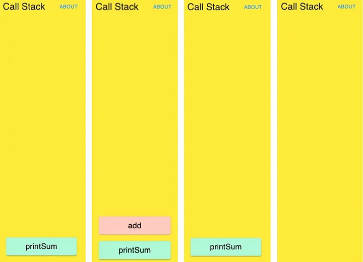

---

### Initializing a Project

```bash
mkdir my-app
cd my-app
npm init -y     # Creates package.json with defaults
```

The `package.json` file is the **identity card** of your project:

```json
{
  "name": "my-app",
  "version": "1.0.0",
  "main": "index.js",
  "scripts": {
    "start": "node index.js",
    "dev": "nodemon index.js"
  },
  "dependencies": {
    "express": "^4.18.2"
  },
  "devDependencies": {
    "nodemon": "^3.0.1"
  }
}
```

---

### Essential NPM Commands

Here is a full reference of npm commands you'll use every day:

| Command | Description |
|---|---|
| `npm init` | Initialize a new project (interactive prompts) |
| `npm init -y` | Initialize with all defaults (skip prompts) |
| `npm install` | Install all dependencies from `package.json` |
| `npm install <pkg>` | Install a package and add to dependencies |
| `npm install <pkg> --save-dev` | Install as dev dependency |
| `npm install <pkg> -g` | Install globally |
| `npm uninstall <pkg>` | Remove a package |
| `npm update` | Update all packages to latest allowed version |
| `npm outdated` | List packages with newer versions available |
| `npm run <script>` | Run a script defined in `package.json` |
| `npm start` | Run the `start` script |
| `npm test` | Run the `test` script |
| `npm cache clean -f` | Force clear the npm cache |
| `npm list` | List installed packages |
| `npm list -g` | List globally installed packages |
| `npm info <pkg>` | Show package metadata |
| `npm login` | Log in to npmjs.com |
| `npm publish` | Publish your package to npm registry |

```bash
# Install a package (saves to dependencies)
npm install express
npm i express                    # shorthand

# Install as dev dependency (only needed during development)
npm install nodemon --save-dev
npm i nodemon -D                 # shorthand

# Install globally (available system-wide as a CLI tool)
npm install -g nodemon

# Install all dependencies from package.json
npm install

# Remove a package
npm uninstall express

# Check for outdated packages
npm outdated

# Update packages
npm update

# Run a script from package.json
npm run start
npm run dev

# Execute a package without installing permanently
npx create-react-app my-app
```

---

### Aliases & Shorthands

npm commands have shorter aliases — you'll see these in tutorials and teammates' code:

```bash
-v  →  --version       # npm -v
-y  →  --yes           # npm init -y
-f  →  --force         # npm cache clean -f
-D  →  --save-dev      # npm i package-name -D
-g  →  --global        # npm i package-name -g
-a  →  --all           # npm outdated -a
```

---

### npx — The Package Runner

`npx` comes bundled with npm. It runs a package without permanently installing it:

```bash
# Without npx — you'd have to install create-react-app globally first
npm install -g create-react-app
create-react-app my-app

# With npx — downloads temporarily, runs, then removes it
npx create-react-app my-app
```

Perfect for one-time tools you don't want polluting your global install.

---

### Semantic Versioning (SemVer)

Package versions follow the pattern `MAJOR.MINOR.PATCH`:

```
4  .  18  .  2
↑      ↑     ↑
MAJOR MINOR PATCH

MAJOR — breaking changes (you may need to update your code)
MINOR — new features, backward compatible
PATCH — bug fixes, backward compatible
```

In `package.json`:
- `"^4.18.2"` — accepts `4.x.x` (minor + patch updates, same major)
- `"~4.18.2"` — accepts `4.18.x` (patch updates only)
- `"4.18.2"` — exact version only

---

### package-lock.json & node_modules

- **`node_modules/`** — where installed packages live. **Never commit this to Git** — it can be 100MB+
- **`package-lock.json`** — exact snapshot of every installed package version. **Always commit this** — ensures everyone on your team uses the exact same versions

```bash
# .gitignore — always have this!
node_modules/
.env
```


---

### NPM Alternatives

| Tool | Key Advantage |
|---|---|
| **Yarn** | Faster, deterministic installs, good caching |
| **pnpm** | Saves disk space with hard links, strictest dependency resolution |

All three use `package.json` and are compatible with the npm registry.

---

### Publishing Your Own Package

```bash
# 1. Create a folder and init
mkdir my-package && cd my-package
npm init -y

# 2. Write your code (index.js)
module.exports = () => console.log('Hello from my package!');

# 3. Test locally
node -e "require('./index')()"

# 4. Login and publish
npm login
npm publish
```

---

## 8 — The File System (fs) Module


The `fs` module is one of Node's most used built-in modules. It lets your Node.js application read, write, update, rename, and delete files on the server.

> 💡 **Always use the async (non-blocking) versions** of fs methods in production. The sync versions block the entire event loop while the file operation runs.

---

### Reading Files

```js
const { readFile } = require('fs/promises');

async function readConfig() {
  try {
    const data = await readFile('./config.json', 'utf8');
    const config = JSON.parse(data);
    console.log(config);
  } catch (error) {
    console.error('Error reading file:', error.message);
  }
}

readConfig();
```

The `'utf8'` encoding tells Node to return a string. Without it, you get a raw `Buffer`.

---

### Writing & Creating Files

```js
const { writeFile, appendFile } = require('fs/promises');

// writeFile — creates or overwrites
async function saveData(filename, data) {
  try {
    await writeFile(filename, JSON.stringify(data, null, 2));
    console.log(`Saved to ${filename}`);
  } catch (error) {
    console.error('Error writing file:', error.message);
  }
}

// appendFile — adds to end of file (creates if doesn't exist)
async function logMessage(message) {
  try {
    await appendFile('./app.log', `${new Date().toISOString()}: ${message}\n`);
  } catch (error) {
    console.error('Error appending to log:', error.message);
  }
}

saveData('./users.json', [{ name: "Marta", age: 21 }]);
logMessage("Server started");
```

---

### Renaming & Deleting Files

```js
const { rename, unlink, mkdir } = require('fs/promises');

// Rename
async function renameFile(from, to) {
  try {
    await rename(from, to);
    console.log(`Renamed ${from} → ${to}`);
  } catch (error) {
    console.error('Error renaming:', error.message);
  }
}

// Delete
async function deleteFile(filePath) {
  try {
    await unlink(filePath);
    console.log(`Deleted ${filePath}`);
  } catch (error) {
    console.error('Error deleting:', error.message);
  }
}

// Create directory
async function createDir(dirPath) {
  try {
    await mkdir(dirPath, { recursive: true }); // recursive: won't error if exists
    console.log(`Created directory: ${dirPath}`);
  } catch (error) {
    console.error('Error creating directory:', error.message);
  }
}
```

---

### Sync vs Async — Why it Matters

```js
const fs = require('fs');

// ❌ Synchronous — blocks the event loop
const data = fs.readFileSync('./bigfile.txt', 'utf8');
console.log(data); // Nothing else runs until this finishes

// ✅ Async with callback
fs.readFile('./bigfile.txt', 'utf8', (err, data) => {
  if (err) throw err;
  console.log(data);
});
console.log("This runs immediately — file reading is in background");

// ✅ Async with promises (preferred)
const { readFile } = require('fs/promises');
const data = await readFile('./bigfile.txt', 'utf8');
```

> ⚠️ `readFileSync`, `writeFileSync`, etc. are fine for **startup scripts** and **configuration loading** (before the server starts accepting requests). Never use them inside a request handler.

---

## 9 — The Event Loop — Deep Dive

### Sync vs Async: The Waiter Analogy

**Synchronous (blocking):**
A waiter refuses to serve any other table until the current table has eaten. Everyone else waits.

```js
const syncWaiter = (name) => {
  console.log(`${name} attends to tables very slowly.`);
};
syncWaiter("Devin");
console.log("At least the orders are correct!");
// Output: in order, predictable
```

**Asynchronous (non-blocking):**
The waiter takes an order, sends it to the kitchen, and serves another table while the food is being prepared. Multiple tasks happen "around the same time."

```js
const asyncWaiter = (name) => {
  setTimeout(() => console.log(`${name} attends tables quickly!`), 3000);
};
asyncWaiter("James");
console.log("All tables attended to quickly!");
// Output:
// All tables attended to quickly!
// James attends tables quickly!  ← after 3 seconds
```

---

### Concurrency vs Parallelism

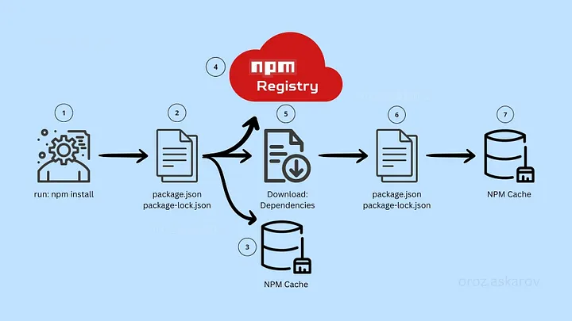

**Concurrency** — multiple tasks making progress around the same time on a **single thread**. Node.js handles concurrency through its event-driven, non-blocking model. Like one waiter serving multiple tables efficiently.

**Parallelism** — multiple tasks running at **exactly the same time** on multiple CPU cores. Node.js achieves this with Worker Threads or the cluster module.

```js
// Parallelism with worker_threads
const { Worker } = require('worker_threads');

new Worker('./worker.js'); // Runs on a separate thread
new Worker('./worker.js'); // Runs on another thread — simultaneously
new Worker('./worker.js');

console.log("Main thread keeps running...");
```

---

### Microtasks vs Macrotasks

This is critical to understand for debugging async code:

```js
console.log("1 - sync");

setTimeout(() => console.log("4 - setTimeout (macrotask)"), 0);

Promise.resolve().then(() => console.log("3 - Promise.then (microtask)"));

process.nextTick(() => console.log("2 - nextTick (highest priority microtask)"));

console.log("5 - sync (last sync line)");

// Output:
// 1 - sync
// 5 - sync (last sync line)
// 2 - nextTick (runs before Promise, highest priority)
// 3 - Promise.then
// 4 - setTimeout (runs last — macrotask)
```

**Priority order:**
1. Synchronous code (call stack)
2. `process.nextTick` callbacks
3. Promise microtasks (`.then`, `.catch`, `async/await`)
4. Macrotasks (`setTimeout`, `setInterval`, `setImmediate`, I/O callbacks)

---

### Event Loop Under Heavy Load


Under load, the event loop can get **starved** — callbacks pile up, latency grows, and eventually the server becomes unresponsive.

**Dangerous pattern — microtask starvation:**
```js
// This will starve the event loop — don't do this!
function recursivePromise() {
  Promise.resolve().then(recursivePromise);
}
recursivePromise(); // CPU hits 100%, no I/O ever processes
```

**Measuring event loop lag:**
```js
const start = process.hrtime.bigint();
setImmediate(() => {
  const delay = Number(process.hrtime.bigint() - start) / 1e6;
  console.log(`Event loop delay: ${delay.toFixed(2)}ms`);
  // < 10ms: healthy | 50-100ms: warning | 200ms+: critical
});
```

---

## 10 — Environment Variables & .env


**Environment variables** are configuration values that live outside your code. They allow the same application to behave differently depending on where it runs — your laptop, a test server, or production cloud.

### Why Use Them?

```js
// ❌ BAD — secrets hardcoded in code
const dbPassword = "mySecretPassword123";
const apiKey = "sk-live-abc123xyz";

// ✅ GOOD — values come from the environment
const dbPassword = process.env.DB_PASSWORD;
const apiKey = process.env.API_KEY;
```

If you commit secrets to Git, they're exposed forever (even if you delete them later). Environment variables keep secrets out of your codebase entirely.

---

### Using process.env

```js
// server.js
const port = process.env.PORT;
console.log(`Your port is ${port}`); // undefined without setting it first
```

**Pass from command line:**
```bash
PORT=8626 node server.js
PORT=8626 NODE_ENV=development node server.js
```

---

### Using a .env File

For multiple variables, a `.env` file is much cleaner:

```bash
# .env
NODE_ENV=development
PORT=3000
DB_HOST=localhost
DB_NAME=myapp_db
DB_PASSWORD=your-password-here
API_KEY=your-api-key-here
JWT_SECRET=your-jwt-secret-here
```

**Install dotenv:**
```bash
npm install dotenv
```

**Load it in your app:**
```js
// server.js — load at the very top
require('dotenv').config();

const port = process.env.PORT || 3000;
console.log(`Server running on port ${port}`);
```

---

### Organizing env vars in a config module

Rather than sprinkling `process.env.SOMETHING` throughout your codebase, centralize them:

```js
// config.js
require('dotenv').config();

module.exports = {
  port: process.env.PORT || 3000,
  nodeEnv: process.env.NODE_ENV || 'development',
  db: {
    host: process.env.DB_HOST || 'localhost',
    name: process.env.DB_NAME,
    password: process.env.DB_PASSWORD
  },
  jwt: {
    secret: process.env.JWT_SECRET,
    expiresIn: process.env.JWT_EXPIRES_IN || '7d'
  }
};
```

```js
// app.js
const config = require('./config');
console.log(`Starting on port ${config.port}`);
console.log(`Environment: ${config.nodeEnv}`);
```

---

### .gitignore & .env.example

**Never commit your `.env` file.** Add it to `.gitignore`:

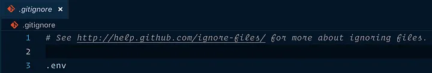

```bash
# .gitignore
node_modules/
.env
*.log
```

**But** always provide a `.env.example` so your teammates know what variables are needed:

```bash
# .env.example — commit this to Git (no real values)
NODE_ENV=development
PORT=3000
DB_HOST=localhost
DB_NAME=your_db_name
DB_PASSWORD=your_password_here
API_KEY=your_api_key_here
JWT_SECRET=your_secret_here
```

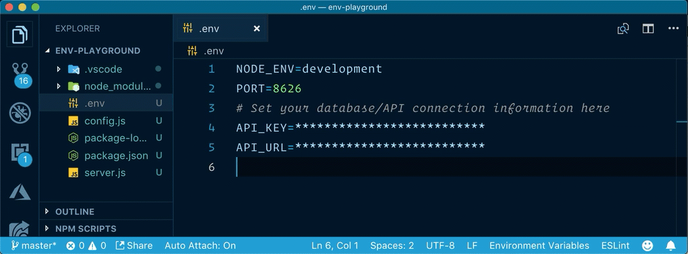

> 💡 Install the **DotENV** extension in VS Code for syntax highlighting in `.env` files.

---

### Preloading dotenv (Advanced)

You can load `.env` without any code changes using the `-r` flag:

```bash
node -r dotenv/config server.js
```

This preloads dotenv before your app starts — useful for production setups where you want minimal runtime dependencies.

Add to `package.json` scripts:
```json
{
  "scripts": {
    "start": "node server.js",
    "dev": "node -r dotenv/config server.js"
  }
}
```

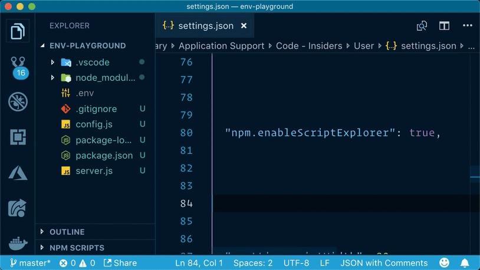

You can right-click any npm script in VS Code's Explorer panel and run or debug it directly.

If you prefer the keyboard, install the **npm extension** for VS Code and run scripts from the command palette:
- `CMD + SHIFT + P` (Mac) or `CTRL + SHIFT + P` (Windows)
- Type `npm` → select **"npm: Run Script"**
- Choose the script you want

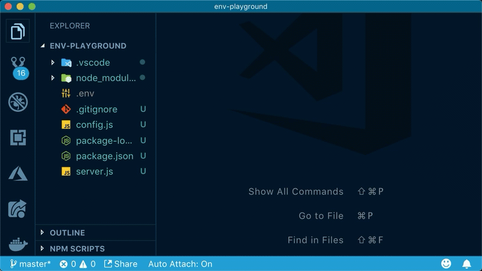

> 💡 To see npm scripts in VS Code's Explorer sidebar, make sure `npm.enableScriptExplorer` is set to `true` in your VS Code settings.

### Your Code is the Same No Matter Where it Runs

The key insight of environment variables: **your application code never changes**. What changes is *how you run it*.

- **Local development** — load from `.env` file via dotenv
- **Docker containers** — pass via `-e` flags or `docker-compose.yml`
- **Cloud providers** (AWS, Heroku, Render, Railway) — set in their dashboard or CLI
- **CI/CD pipelines** — set as pipeline secrets

Your `process.env.PORT` always works the same way regardless of where the value comes from. This is the foundation of the [12-Factor App](https://12factor.net) methodology — the standard for building production-ready cloud applications.

**Sharing env vars with your team:**

When `.env` is gitignored, teammates don't know what variables the app needs. The solution: a `.env.example` file with the variable names but no real values:

```bash
# .env.example — commit this to Git
NODE_ENV=development
PORT=3000
DB_HOST=localhost
DB_NAME=your_db_name_here
DB_PASSWORD=your_db_password_here
API_KEY=your_api_key_here
JWT_SECRET=your_jwt_secret_here
```

New teammate clones the repo, copies `.env.example` to `.env`, fills in real values, and they're running. No calls to you asking "what env vars do I need?"

---

## 11 — Building an HTTP Server

The `http` module lets you create a full web server with zero dependencies:

```js
const http = require('http');

const server = http.createServer((req, res) => {
  // req = incoming request (url, method, headers, body)
  // res = outgoing response

  res.writeHead(200, { 'Content-Type': 'text/plain' });
  res.end('Hello, World!');
});

server.listen(3000, () => {
  console.log('Server running at http://localhost:3000/');
});
```

**Handling different routes:**

```js
const http = require('http');

const server = http.createServer((req, res) => {
  const { url, method } = req;

  if (url === '/' && method === 'GET') {
    res.writeHead(200, { 'Content-Type': 'application/json' });
    res.end(JSON.stringify({ message: 'Welcome to my API' }));

  } else if (url === '/users' && method === 'GET') {
    res.writeHead(200, { 'Content-Type': 'application/json' });
    res.end(JSON.stringify([{ id: 1, name: 'Marta' }]));

  } else {
    res.writeHead(404, { 'Content-Type': 'application/json' });
    res.end(JSON.stringify({ error: 'Not found' }));
  }
});

server.listen(3000, () => console.log('Running on http://localhost:3000'));
```

> 📝 In the next module (Express.js), we'll use a framework that makes routing much cleaner. The raw `http` module is useful to understand, but most real apps use Express on top of it.

---

## 12 — Error Handling

Error handling is one of the most important skills in Node.js. Unhandled errors crash your server. Poorly handled errors leak sensitive information. Good error handling keeps your app stable and your users informed.

---

### Error-First Callbacks (Old Pattern)

Before Promises, Node.js used a convention called **error-first callbacks** — the first argument is always the error, the second is the result:

```js
fs.readFile('./config.json', 'utf8', (err, data) => {
  if (err) {
    // ALWAYS check for error first
    console.error('Failed to read file:', err.message);
    return; // stop execution here
  }
  // Safe to use data here
  console.log(JSON.parse(data));
});
```

> ⚠️ The `return` after handling the error is critical. Without it, execution continues into the success code with `data` being `undefined`.

---

### try/catch with async/await

```js
async function loadUser(id) {
  try {
    const data = await readFile(`./users/${id}.json`, 'utf8');
    return JSON.parse(data);
  } catch (error) {
    if (error.code === 'ENOENT') {
      throw new Error(`User ${id} not found`);
    }
    throw error; // re-throw unexpected errors
  }
}
```

---

### Custom Error Classes

Instead of throwing generic `Error` objects, create specific error types that carry useful metadata:

```js
// errors.js
class AppError extends Error {
  constructor(message, statusCode = 500) {
    super(message);
    this.name = this.constructor.name;
    this.statusCode = statusCode;
    Error.captureStackTrace(this, this.constructor);
  }
}

class NotFoundError extends AppError {
  constructor(resource) {
    super(`${resource} not found`, 404);
  }
}

class ValidationError extends AppError {
  constructor(message) {
    super(message, 400);
  }
}

class UnauthorizedError extends AppError {
  constructor() {
    super('Authentication required', 401);
  }
}

module.exports = { AppError, NotFoundError, ValidationError, UnauthorizedError };
```

```js
// Usage
const { NotFoundError, ValidationError } = require('./errors');

async function getUser(id) {
  if (!id) throw new ValidationError('User ID is required');
  const user = await db.findUser(id);
  if (!user) throw new NotFoundError('User');
  return user;
}
```

---

### Global Error Handlers

Always catch errors that slip through everything else:

```js
// Unhandled Promise rejections
process.on('unhandledRejection', (reason, promise) => {
  console.error('Unhandled Rejection at:', promise, 'reason:', reason);
  // In production — log it and exit gracefully
  process.exit(1);
});

// Uncaught synchronous exceptions
process.on('uncaughtException', (error) => {
  console.error('Uncaught Exception:', error);
  // MUST exit — process state is now unreliable
  process.exit(1);
});

// Graceful shutdown signal (Ctrl+C or kill signal)
process.on('SIGTERM', () => {
  console.log('SIGTERM received. Shutting down gracefully...');
  server.close(() => {
    console.log('Server closed. Exiting.');
    process.exit(0);
  });
});
```

> 🧠 **Rule:** After an `uncaughtException`, always exit and restart. The process may be in an inconsistent state. Use a process manager like PM2 to auto-restart.

---

### Common Node.js Error Codes

| Code | Meaning |
|---|---|
| `ENOENT` | No such file or directory |
| `EACCES` | Permission denied |
| `EEXIST` | File already exists |
| `EISDIR` | Expected a file, got a directory |
| `ENOTDIR` | Expected a directory, got a file |
| `ECONNREFUSED` | Connection refused (server not running) |
| `ETIMEDOUT` | Connection timed out |
| `EADDRINUSE` | Port already in use |

```js
if (error.code === 'EADDRINUSE') {
  console.error(`Port ${port} is already in use. Try a different port.`);
  process.exit(1);
}
```

---

## 13 — Debugging Node.js

Knowing how to debug is as important as knowing how to code. `console.log` everywhere is not debugging — it's guessing.

---

### Built-in Inspector

Node.js has a built-in debugger powered by Chrome DevTools:

```bash
# Start in inspect mode
node --inspect app.js

# Start AND pause at first line (useful to catch startup issues)
node --inspect-brk app.js
```

Then open Chrome and go to `chrome://inspect` — your Node process appears under **Remote Targets**. Click **inspect** to open full Chrome DevTools with:
- Breakpoints
- Step through code
- Watch expressions
- Call stack
- Memory profiling

---

### VS Code Debugger

The best debugging experience for Node.js. Create `.vscode/launch.json`:

```json
{
  "version": "0.2.0",
  "configurations": [
    {
      "type": "node",
      "request": "launch",
      "name": "Debug App",
      "program": "${workspaceFolder}/app.js",
      "envFile": "${workspaceFolder}/.env",
      "console": "integratedTerminal",
      "restart": true
    }
  ]
}
```

Press **F5** to start debugging. Set breakpoints by clicking the gutter next to line numbers.

---

### The `debug` Package

Better than `console.log` — namespaced, toggleable, colored:

```bash
npm install debug
```

```js
const debug = require('debug');

const dbLog  = debug('app:db');
const httpLog = debug('app:http');

dbLog('Connected to database');      // only shows when enabled
httpLog('GET /users called');        // only shows when enabled
```

```bash
# Enable specific namespaces
DEBUG=app:db node app.js           # only db logs
DEBUG=app:* node app.js            # all app logs
DEBUG=* node app.js                # everything (including npm internals)
```

This is how Express.js itself does internal debugging.

---

## 14 — Timers Module

Node.js has a global timers module — no `require` needed. These are the same as browser timers but with some Node-specific additions.

```js
// setTimeout — run once after a delay
const timer = setTimeout(() => {
  console.log('Runs after 2 seconds');
}, 2000);

clearTimeout(timer); // cancel it before it fires

// setInterval — run repeatedly
const interval = setInterval(() => {
  console.log('Runs every second');
}, 1000);

clearInterval(interval); // stop the interval

// setImmediate — run after current event loop phase (before next setTimeout)
setImmediate(() => {
  console.log('Runs immediately after I/O');
});

// process.nextTick — run before ANYTHING else (highest priority)
process.nextTick(() => {
  console.log('Runs before any I/O or timers');
});
```

**Practical example — polling with setInterval:**

```js
// Check a condition every 5 seconds, stop when met
const pollInterval = setInterval(async () => {
  const status = await checkJobStatus(jobId);

  if (status === 'complete') {
    console.log('Job finished!');
    clearInterval(pollInterval); // stop polling
  } else if (status === 'failed') {
    console.error('Job failed');
    clearInterval(pollInterval);
  }
}, 5000);
```

**Avoid timer drift with recursive `setTimeout` instead of `setInterval`:**

```js
// setInterval fires every N ms regardless of how long the callback takes
// This can cause overlap if callback is slow

// Better pattern — next timer only starts after current one finishes
function scheduleTask() {
  setTimeout(async () => {
    await doWork(); // wait for work to finish
    scheduleTask(); // then schedule next run
  }, 5000);
}
scheduleTask();
```

---

## 15 — Crypto Module

The built-in `crypto` module provides cryptographic functionality. You'll use this for hashing passwords, generating tokens, creating checksums, and signing data.

> 💡 For password hashing in real apps, use `bcrypt` or `argon2` npm packages — they're specifically designed for passwords with configurable work factors. Use `crypto` for tokens, checksums, and HMACs.

---

### Hashing

```js
const crypto = require('crypto');

// SHA-256 hash — deterministic, same input always gives same output
function hashData(data) {
  return crypto.createHash('sha256').update(data).digest('hex');
}

console.log(hashData('hello')); // 2cf24dba5fb...  (always the same)
console.log(hashData('hello')); // 2cf24dba5fb...  (same again)
console.log(hashData('Hello')); // 185f8db32921... (different — case sensitive!)
```

---

### Generating Secure Random Tokens

Perfect for password reset tokens, API keys, session secrets:

```js
// Generate a cryptographically secure random token
function generateToken(bytes = 32) {
  return crypto.randomBytes(bytes).toString('hex');
  // 32 bytes = 64 character hex string
}

console.log(generateToken());    // e.g. "a3f2c1d9e8b7..."
console.log(generateToken(16));  // 32 character hex string

// Async version (non-blocking for large quantities)
crypto.randomBytes(32, (err, buffer) => {
  if (err) throw err;
  const token = buffer.toString('hex');
  console.log(token);
});

// Modern promise version
const { randomBytes } = require('crypto').promises;
const token = (await randomBytes(32)).toString('hex');
```

---

### HMAC — Message Authentication

Used to verify that data hasn't been tampered with (webhooks, signed URLs):

```js
// Create HMAC signature
function signPayload(payload, secret) {
  return crypto
    .createHmac('sha256', secret)
    .update(JSON.stringify(payload))
    .digest('hex');
}

// Verify signature — use timingSafeEqual to prevent timing attacks!
function verifyPayload(payload, signature, secret) {
  const expected = signPayload(payload, secret);
  const a = Buffer.from(signature);
  const b = Buffer.from(expected);
  if (a.length !== b.length) return false;
  return crypto.timingSafeEqual(a, b);
}

const secret  = process.env.WEBHOOK_SECRET;
const payload = { event: 'payment.completed', amount: 100 };
const sig     = signPayload(payload, secret);

console.log(verifyPayload(payload, sig, secret)); // true
```

---

### UUID Generation

```js
// Node 14.17+ has built-in UUID v4
const { randomUUID } = require('crypto');
console.log(randomUUID()); // 'f47ac10b-58cc-4372-a567-0e02b2c3d479'
```

---

## 16 — Child Processes

Sometimes you need to run external programs, shell commands, or separate Node.js scripts. The `child_process` module handles this.

---

### `exec` — Run a shell command, get output as string

```js
const { exec } = require('child_process');

exec('ls -la', (error, stdout, stderr) => {
  if (error) {
    console.error('Error:', error.message);
    return;
  }
  if (stderr) console.error('stderr:', stderr);
  console.log('Output:', stdout);
});

// Promise version
const { promisify } = require('util');
const execAsync = promisify(exec);

const { stdout } = await execAsync('git log --oneline -5');
console.log(stdout);
```

> ⚠️ Never pass user input directly to `exec` — it executes shell commands and is vulnerable to **shell injection**. Use `execFile` or `spawn` instead.

---

### `spawn` — Stream large output, run any program

```js
const { spawn } = require('child_process');

// Stream output in real time — great for long-running commands
const process = spawn('node', ['--version']);

process.stdout.on('data', data => console.log(data.toString()));
process.stderr.on('data', data => console.error(data.toString()));
process.on('close', code => console.log(`Exited with code ${code}`));
```

---

### `fork` — Run another Node.js file with messaging

```js
// main.js
const { fork } = require('child_process');

const worker = fork('./heavyTask.js');

worker.send({ numbers: Array.from({ length: 1000000 }, (_, i) => i) });

worker.on('message', result => {
  console.log('Sum:', result.sum);
});

worker.on('exit', code => {
  console.log(`Worker exited with code ${code}`);
});
```

```js
// heavyTask.js
process.on('message', ({ numbers }) => {
  const sum = numbers.reduce((a, b) => a + b, 0);
  process.send({ sum });
  process.exit(0);
});
```

---

### `execFile` — Run a specific file safely (no shell)

```js
const { execFile } = require('child_process');

// Safe from shell injection — args are passed directly
execFile('node', ['--version'], (error, stdout) => {
  console.log(stdout.trim()); // v20.11.0
});
```

---

## 17 — Working with JSON

JSON is the primary data format in Node.js backends — API responses, config files, data storage. Knowing how to work with it efficiently is essential.

---

### Reading & Writing JSON Files

```js
const { readFile, writeFile } = require('fs/promises');
const path = require('path');

// Read JSON file
async function readJSON(filePath) {
  const raw = await readFile(filePath, 'utf8');
  return JSON.parse(raw);
}

// Write JSON file (formatted, readable)
async function writeJSON(filePath, data) {
  await writeFile(filePath, JSON.stringify(data, null, 2), 'utf8');
}

// Usage
const users = await readJSON('./data/users.json');
users.push({ id: 4, name: 'Hana' });
await writeJSON('./data/users.json', users);
```

---

### JSON.parse & JSON.stringify

```js
// Parse — string to object
const obj = JSON.parse('{"name":"Marta","age":21}');
console.log(obj.name); // "Marta"

// Stringify — object to string
const str = JSON.stringify({ name: 'Marta', age: 21 });
// '{"name":"Marta","age":21}'

// Pretty print (indent with 2 spaces)
const pretty = JSON.stringify({ name: 'Marta', age: 21 }, null, 2);
/*
{
  "name": "Marta",
  "age": 21
}
*/

// Replacer — exclude certain fields
const safe = JSON.stringify(
  { name: 'Marta', password: 'secret', age: 21 },
  ['name', 'age'] // only include these fields
);
// '{"name":"Marta","age":21}' — password excluded!
```

---

### Always Handle Parse Errors

```js
function safeParseJSON(str) {
  try {
    return { data: JSON.parse(str), error: null };
  } catch (error) {
    return { data: null, error: 'Invalid JSON: ' + error.message };
  }
}

const { data, error } = safeParseJSON(req.body);
if (error) return res.status(400).json({ error });
```

---

### Deep Clone with JSON (Quick Trick)

```js
// Quick deep clone — works for plain data (no functions, no Date, no undefined)
const original = { a: 1, nested: { b: 2 } };
const clone = JSON.parse(JSON.stringify(original));

clone.nested.b = 99;
console.log(original.nested.b); // still 2 — true deep copy

// For complex objects with Dates, use structuredClone() (Node 17+)
const clone2 = structuredClone(original);
```

---

## 18 — Streams & Buffers

### 🌊 What are Streams?

A **stream** is a way to handle data in **chunks** rather than loading everything into memory at once. Imagine reading a 10GB log file — you can't load it all into memory. Streams read it piece by piece.

There are 4 types of streams:

| Type | Description | Example |
|---|---|---|
| Readable | Read data from a source | `fs.createReadStream()` |
| Writable | Write data to a destination | `fs.createWriteStream()` |
| Duplex | Both readable and writable | TCP socket |
| Transform | Modify data as it passes through | `zlib` compression |

```js
const fs = require('fs');

// Read a large file in chunks — memory efficient
const readStream = fs.createReadStream('./bigfile.txt', 'utf8');

readStream.on('data', chunk => {
  console.log(`Received ${chunk.length} bytes`);
});

readStream.on('end', () => {
  console.log('Finished reading');
});

readStream.on('error', err => {
  console.error('Error:', err.message);
});
```

---

### 🔗 Piping Streams

Pipe connects a readable stream directly to a writable stream:

```js
const fs = require('fs');
const zlib = require('zlib');

// Compress a file — streams data through without loading into memory
fs.createReadStream('./large.txt')
  .pipe(zlib.createGzip())           // transform: compress
  .pipe(fs.createWriteStream('./large.txt.gz')); // write compressed output

console.log('Compressing...');
```

This handles files of any size efficiently because no more than one chunk is in memory at a time.

---

### 🔢 Buffers

A **Buffer** is a fixed-size allocation of raw binary memory. Used when working with binary data: images, files, network packets.

```js
// Create a buffer from a string
const buf = Buffer.from('Hello, Node!', 'utf8');
console.log(buf);           // <Buffer 48 65 6c 6c 6f 2c 20 4e 6f 64 65 21>
console.log(buf.toString()); // "Hello, Node!"
console.log(buf.length);     // 12 (bytes)

// Allocate a buffer of specific size
const buf2 = Buffer.alloc(10); // 10 bytes, filled with zeros
```

> 💡 You'll encounter Buffers when reading files without specifying encoding, handling binary uploads, or working at the TCP level. For most day-to-day Node.js work, you'll use strings and the `'utf8'` encoding.

---

## 19 — Learning Resources

### 📺 YouTube

#### 🟢 Start Here — Beginner

| Channel | Video | What You'll Learn |
|---|---|---|
| Traversy Media | [Node.js Crash Course](https://www.youtube.com/watch?v=fBNz5xF-Kx4) | Complete beginner intro — setup to HTTP server (1.5 hrs) |
| Programming with Mosh | [Node.js Tutorial for Beginners](https://www.youtube.com/watch?v=TlB_eWDSMt4) | Modules, NPM, events, fs, HTTP — very clear teaching style |
| The Net Ninja | [Node.js Crash Course Playlist](https://www.youtube.com/playlist?list=PL4cUxeGkcC9jszmQoUkCm7Kgb4T_Lhc0E) | 15-part series, step-by-step, great for beginners |
| freeCodeCamp | [Node.js Full Course](https://www.youtube.com/watch?v=Oe421EPjeBE) | 8-hour comprehensive course covering all fundamentals |
| Academind | [Node.js — The Complete Guide](https://www.youtube.com/watch?v=C7TFgfY7JdE) | Deep intro with real project examples |

#### 🟡 Core Concepts — Go Deeper

| Channel | Video | What You'll Learn |
|---|---|---|
| Hussein Nasser | [Node.js Event Loop](https://www.youtube.com/watch?v=8aGhZQkoFbQ) | Best visual explanation of the event loop |
| Hussein Nasser | [Node.js Streams](https://www.youtube.com/watch?v=GlybFFMXXmQ) | Readable, writable, duplex, transform streams |
| Traversy Media | [NPM Crash Course](https://www.youtube.com/watch?v=jHDhaSSKmB0) | Everything about npm, package.json, scripts |
| Web Dev Simplified | [Node.js Modules Explained](https://www.youtube.com/watch?v=9Tl3OmFDlSo) | CommonJS vs ES Modules, module caching |
| Fireship | [Node.js in 100 Seconds](https://www.youtube.com/watch?v=ENrzD9HAZK4) | Quick mental model of what Node.js is and does |
| Codevolution | [Node.js Tutorial Playlist](https://www.youtube.com/playlist?list=PLC3y8-rFHvwh8shCMHFA5kWxD9PaPwxaY) | 40+ videos covering every core concept in depth |
| Dave Gray | [Node.js Full Course for Beginners](https://www.youtube.com/watch?v=f2EqECiTBL8) | 7-hour project-based course with file system, modules, npm |

#### 🔴 Advanced & Production

| Channel | Video | What You'll Learn |
|---|---|---|
| Hussein Nasser | [Node.js Under the Hood](https://www.youtube.com/watch?v=OCjvhCFFPTw) | libuv, thread pool, event loop internals |
| Hussein Nasser | [Node.js Cluster Module](https://www.youtube.com/watch?v=lq_gZyBRYSA) | Multi-core utilization with cluster |
| Traversy Media | [Node.js & Express REST API](https://www.youtube.com/watch?v=l8WPWK9mS5M) | Build a complete REST API (bridges to Module 03) |
| Fireship | [10 Node.js Security Best Practices](https://www.youtube.com/watch?v=i6k5WKuPtF4) | Production security patterns |
| Jack Herrington | [Node.js Worker Threads](https://www.youtube.com/watch?v=MuwJJrfIfsU) | CPU parallelism with worker threads |
| TechWorld with Nana | [Node.js + Docker Tutorial](https://www.youtube.com/watch?v=3c-iBn73dDE) | Containerizing Node.js apps |

#### 📺 Full Channels Worth Subscribing To

| Channel | Why Follow |
|---|---|
| [Traversy Media](https://www.youtube.com/@TraversyMedia) | Best crash courses, always up to date, project-based |
| [The Net Ninja](https://www.youtube.com/@NetNinja) | Deep playlist series, excellent pacing for beginners |
| [Fireship](https://www.youtube.com/@Fireship) | Fast, dense, entertaining — great for concepts and trends |
| [Hussein Nasser](https://www.youtube.com/@hnasr) | Best backend engineering depth on YouTube |
| [Web Dev Simplified](https://www.youtube.com/@WebDevSimplified) | Clear explanations, good at making complex things simple |
| [Codevolution](https://www.youtube.com/@Codevolution) | Long structured playlists covering Node, Express, React |
| [Dave Gray](https://www.youtube.com/@DaveGrayTeachesCode) | Long-form tutorials, great production quality |

### 📚 Official Documentation

| Resource | Link |
|---|---|
| Node.js Official Docs | [nodejs.org/en/docs](https://nodejs.org/en/docs) |
| Node.js Guides | [nodejs.org/en/learn](https://nodejs.org/en/learn) |
| npm Documentation | [docs.npmjs.com](https://docs.npmjs.com) |

### 📖 Articles & Books

| Resource | Topic |
|---|---|
| [Node.js Best Practices (GitHub)](https://github.com/goldbergyoni/nodebestpractices) | 90+ best practices, production-ready |
| [The Node.js Event Loop — nodejs.dev](https://nodejs.dev/en/learn/the-nodejs-event-loop/) | Official deep dive |
| [You Don't Know Node — freeCodeCamp](https://www.freecodecamp.org/news/you-dont-know-node-6515d658c7) | Core concepts explained deeply |
| [12 Factor App](https://12factor.net) | Standard for building cloud-ready apps |

### 🛠️ Practice

| Platform | What |
|---|---|
| [nodejs.dev/learn](https://nodejs.dev/learn) | Official interactive learning path |
| [NodeSchool](https://nodeschool.io) | Free hands-on workshops via terminal |
| [exercism.io/tracks/node](https://exercism.io/tracks/node) | Challenges with mentor feedback |

---

## 20 — Quick Knowledge Check

Try to answer these without looking back:

**Node.js Basics**
1. What is Node.js? Is it a programming language, framework, or runtime?
2. What is the V8 engine and where does it come from?
3. Name three things you can do in Node.js that you cannot do in a browser.
4. What does `libuv` do in Node.js?

**Modules & NPM**
5. What is the difference between `require()` and `import`?
6. What does `module.exports` do?
7. What's the difference between `dependencies` and `devDependencies` in `package.json`?
8. What does `npm install` do when run in a project with `package.json`?
9. Why should `node_modules/` never be committed to Git?

**Event Loop**
10. Why can Node.js handle thousands of concurrent connections even though it's single-threaded?
11. What is the difference between synchronous and asynchronous code?
12. Which runs first — a `setTimeout` callback or a Promise `.then` callback?
13. What happens to your server if you run a CPU-heavy `for` loop in a request handler?

**File System & Environment**
14. What is the difference between `fs.readFile()` and `fs.readFileSync()`?
15. Why should you never commit your `.env` file to Git?
16. What is the purpose of `.env.example`?
17. What does `process.env.PORT` do?

**Error Handling & Security**
18. What is an error-first callback? Write an example.
19. What is the difference between `uncaughtException` and `unhandledRejection`?
20. What is a timing attack and how does `crypto.timingSafeEqual` prevent it?
21. What Node.js error code means "file not found"?

**Advanced Topics**
22. What is the difference between `spawn()`, `exec()`, and `fork()`?
23. Why should you NOT pass user input directly to `exec()`?
24. What are two ways to deep clone an object in Node.js?
25. When should you use Worker Threads vs the cluster module?
26. How would you measure event loop lag in production?
27. What does `process.nextTick()` do and when would you use it?
28. What is `crypto.randomBytes()` used for?

---

> 🎯 **You've completed Module 02!**
>
> Move to **[Module 03 — Express.js →](../03-ExpressJS/README.md)**
>
> You now understand how Node.js works under the hood. Time to build real web servers with Express — without writing raw `http` handlers! 🚀
